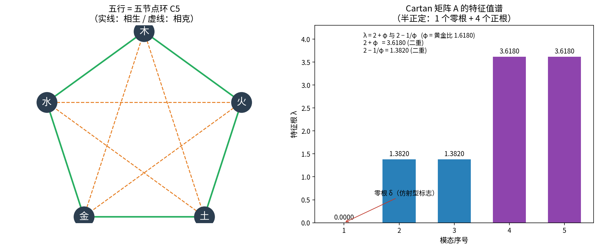
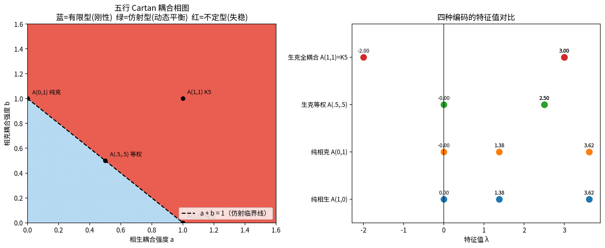
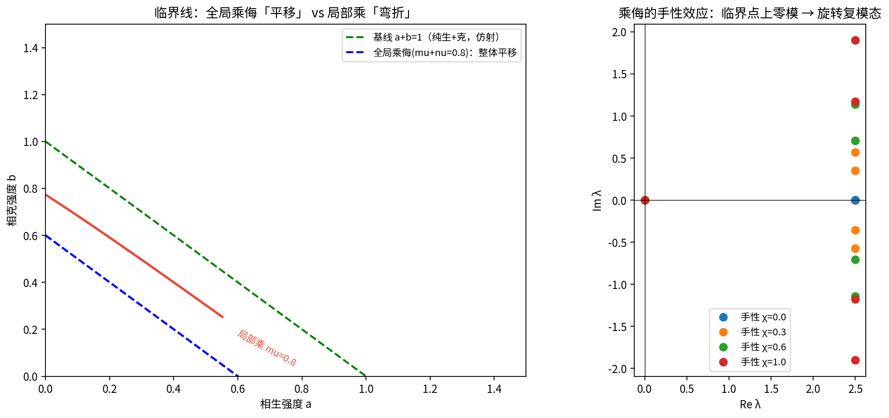
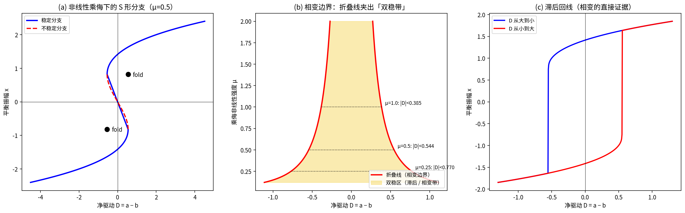

# 五行数学结构 · 研究笔记

> 一份关于"把中医五行学说数学化"的探索归档。
> 缘起：系统萃取知识库"阴阳五行"主题后，逐篇读解文献，并动手核算、构造、模拟，形成一条从"结构"到"相变"的完整链条。
> 记录时间：2026-09-11；2026-09-12 增补 §六（系统科学视角）。

---

## 〇、一句话总纲

**五行不是"五种物质的清单"，而是一张"五节点环"的关系网；四代学人用四套数学语言反复编码同一个环，而我们把它从"结构"一路推到了"相变"：五行的病，是一场折叠（fold）。**

---

## 一、学术谱系：四篇文献（2006→2012）

| 年份 | 文献 | 作者/出处 | 数学工具 | 解决的问题 | 留下的空白 |
|---|---|---|---|---|---|
| 2006 | 《五行理论的数学模型及其微分方程组的通解》 | 赵威、赵致镛，《四川中医》24(11):7-9 | 常微分方程组 | **列方程、给通解框架** | 未讨论解的性质、无实测 |
| 2008 | 《五行学说思维模型的数学结构》 | 吴大为等 | 矩阵 / 群论 | **证明结构**（不可约、可控可观） | 未涉及时间演化 |
| 2010 | 《中医五行学说的数学模型与仿射型广义Cartan矩阵》 | 古立翠，《黑龙江医药》23(1):77-78 | Dynkin图 / Cartan 矩阵 | **接入李代数**（$`A_4^{(1)}`$） | 只做识别+表示、未推导 |
| 2012 | 《中医五行理论的数学分析方法探究》 | 李晓伟，天津中医药大学（导师王益民） | 线性方程组 + MATLAB | **数值定性**（有界稳定域、治疗=系数干预） | 线性、非解析 |

**谱系读解**：**赵文给"方程"，吴文给"结构"，古文给"代数根系统"，李文给"数值与稳定性"**——四者接力，缺一不可。

---

## 二、统一的底层对象：五节点环 $`C_5`$

四篇文献的数学工具各不相同，但**底层图完全相同**——五节点环（五边形）：

| 文献 | 底层"图" | 代数对象 |
|---|---|---|
| 吴 2008 | 5-环 $`C_5`$ | 循环群 $`C_5`$，$`R^5=I`$ |
| 赵 2006 | 5-环耦合 | 生成元 $`A`$，$`e^{At}`$ |
| 李 2012 | 5-环耦合 | 系数矩阵、有界稳定域 |
| 古 2010 | 5-环 $`=\tilde A_4`$ | 仿射 Kac–Moody 代数 |

**它们全部落在同一个对象上——五节点环状图。**

---

## 三、关键数学结论（含本笔记的动手核算）

### 3.1 相生矩阵 $`R`$：五行的"生"是一个离散旋转

编号：木 1、火 2、土 3、金 4、水 5。相生关系写成 5×5 循环置换矩阵：

```
R = [0 1 0 0 0
     0 0 1 0 0
     0 0 0 1 0
     0 0 0 0 1
     1 0 0 0 0]
```

- $`\{I,R,R^2,R^3,R^4\}`$ 构成 **5 阶循环群**，且都是**正交矩阵**（$`R^5=I`$）；
- 特征值 $`=e^{2\pi ik/5}`$（5 次单位根），全在**单位圆**上 → 纯周期；
- **整个关系网由单一生成元 $`R`$ 生成**：相克 $`S=R^2`$、相侮 $`W=R^3`$、子病及母 $`V=R^4`$（生、克、侮、母子**全是 $`R`$ 的幂**）；
- $`R`$ **不可约**（5-环强连通，不能块对角化）→ **"整体不可分"**。

### 3.2 仿射 Cartan 矩阵 $`A_4^{(1)}`$ 核算（动手验证）

古立翠给出的矩阵（本笔记用 Python 复算）：

$$A=\begin{bmatrix}2&-1&0&0&-1\\-1&2&-1&0&0\\0&-1&2&-1&0\\0&0&-1&2&-1\\-1&0&0&-1&2\end{bmatrix}=2I-\mathrm{Adj}(C_5)$$

**核算结果（全部通过）**：

| 检验项 | 计算值 | 判定 |
|---|---|---|
| 对称性 | $`A=A^\mathsf{T}`$ | 可对称化 |
| 行列式 | $`\det(A)=0`$ | 退化——**仿射型**标志 |
| 秩 | $`=4`$（零度 1） | $`=n-1`$ |
| 特征值 | $`\{0,\ 1.381966,\ 1.381966,\ 3.618034,\ 3.618034\}`$ | **半正定** |
| 零特征向量 | $`\frac{1}{\sqrt5}(1,1,1,1,1)`$ | **零根**方向 |
| 对照：有限型 $`A_4`$（链） | $`\det=5`$，全正定 | 刚性 |

**亮点（意外收获）**：
1. **黄金比 $`\varphi=\frac{1+\sqrt5}{2}`$ 自动出现**：非零特征根 $`=2+\varphi`$ 与 $`2-\tfrac1\varphi`$（各二重）——即 $`3.618034`$ 与 $`1.381966`$；因为"五节点环＝五边形"，而五边形的对角线之比正是黄金比。

   **"五"这个数一进入几何，$`\varphi`$ 必然现身。**（注：$`\varphi`$ 与 $`\tfrac1\varphi`$ 成对出现，切勿误写为 $`2\pm\varphi`$——$`2-\varphi=0.382`$ 并不在谱里。）
2. **零根＝全 1 向量**：五行在系统层面**等权、无主次、无起点**。
3. **仿射 vs 有限，只差"首尾是否相连"**：链（$`A_4`$）正定；把首尾接上成环（$`A_4^{(1)}`$）→ 半正定、出现零模。**"环"这个动作，恰好制造出"零"——这就是"如环无端"的代数真相。**



### 3.3 同时编码"生 + 克"：相图与临界线

以强度 $`a,b`$ 编码相生环与相克环：$`M(a,b)=2I-a\,\mathrm{Adj}(C_5^{生})-b\,\mathrm{Adj}(C_5^{克})`$。

**发现**：
- **$`C_5`$ 是自补图**：相生环的谱与相克环的谱**完全相同**（$`\{2,0.618,0.618,-1.618,-1.618\}`$）；相生 + 相克 $`=`$ 完全图 $`K_5`$。
- 解析特征值（$`\varphi=1.618`$）：$`\mu_0=2-2(a+b)`$，$`\mu_{1,4}=2-\frac1\varphi a+\varphi b`$，$`\mu_{2,3}=2+\varphi a-\frac1\varphi b`$。
- **相图**：

| 区域 | 类型 | 语义 |
|---|---|---|
| $`a+b<1`$ | 有限型（正定） | 刚性 |
| $`a+b=1`$ | **仿射型**（半正定，一零根） | **动态平衡 / 临界** |
| $`a+b>1`$ | 不定型（含负特征值） | 失稳 / 亢害 |

- **关键张力**：整数 Cartan 框架下，两键都取 $`-1`$ 得 $`K_5`$（$`=3I-J`$，谱 $`\{-2,3,3,3,3\}`$，$`\det=-162`$）→ **不定型**。

  **"生克俱满"与"仿射（动态平衡）"在整数框架内互斥**；要兼得，需放宽到实数加权并使 $`a+b=1`$（如等权 $`a=b=0.5`$：$`M=2.5I-0.5J`$，谱 $`\{0,2.5,2.5,2.5,2.5\}`$，**仿射型**）。

> **"生克总强度恰为 $`1`$"＝ "以平为期"的定量表达。**



### 3.4 乘侮微扰：平移与弯折

把"乘"（克太过）与"侮"（反克）作为非对称微扰。**关键先验：乘、侮与"克"共用同一条边**，不新增连通性。

**全局乘侮** → 矩阵分解为

$$\underbrace{2I-a\,\mathrm{Adj}(生)-\big(b+\tfrac{\mu+\nu}{2}\big)\mathrm{Adj}(克)}_{对称部分}+\underbrace{\tfrac{\mu-\nu}{2}(C-C^\mathsf{T})}_{手性}$$

对称部分位移 ⟹ 临界线**整体平移**为 $`a+b+\frac{\mu+\nu}{2}=1`$；手性项**不移动边界**，但把实谱**复化**（引入旋转）。

**局部乘**（只在"木克土"一条边，$`\mu=1`$）→ 临界线在该方向**弯折**：$`a=0`$ 处临界 $`b`$ 由 $`1.000`$ 降至约 $`0.689`$（精确值 $`0.6889`$）。

> **乘侮不改变五行的"图"，只改变它的"度"与"向"：全局→平移；局部→弯折；乘≠侮→手性旋转。**



### 3.5 非线性化乘侮 → 折叠（相变）

有效模型：$`\dfrac{dx}{dt}=D+x-\mu x^3`$（$`D=a-b`$ 为净驱动，$`-\mu x^3`$ 为乘侮的**非线性**压制）。

平衡：$`D=\mu x^3-x`$（**S 形**）；折点：

$$x=\pm\frac{1}{\sqrt{3\mu}},\qquad |D|=\frac{2}{3}\frac{1}{\sqrt{3\mu}}$$

**结论**：
- **线性的一条临界线 → 非线性下折叠成两条折叠线，夹出"双稳带"**；
- $`|D|<D_\text{fold}`$：**三个平衡态（两稳一不稳）＝ 双稳**；否则单一平衡态；
- **滞后回线**（数值）：$`D=0`$ 时下降支 $`x=+1.414`$、上升支 $`x=-1.414`$ → **路径依赖成立**；
- 乘侮越强，双稳带越窄（$`\mu=0.25\to0.770`$；$`\mu=1.0\to0.385`$）。

> **"乘"的非线性，是五行系统"能生病、且病能突变"的代数根源**（$`\mu\to0`$ 则折叠消失）；**双稳＝"健/病"共存；滞后＝"病去如抽丝"。**



---

## 四、结论链（一句话递进）

> **结构**（吴 2008：$`C_5`$ 与 $`R^5=I`$）
> → **动力**（赵 2006：$`e^{At}`$）
> → **稳定**（李 2012：有界稳定域）
> → **代数根系统**（古 2010：仿射 Cartan $`\tilde A_4`$）
> → **生克兼编码**（相图 $`a+b=1`$）
> → **乘侮微扰**（平移 / 弯折 / 手性）
> → **非线性相变**（fold / 双稳 / 滞后）
> → **系统科学**（正负反馈 · 自稳网络）

**从"五行是一张关系网"，一路推到"五行的病，是一场 fold 相变"；再从控制论看，它是一台正负反馈耦合驱动的自稳机器。**

---

## 五、与「旋量-太极」的结构映射

| 五行矩阵 | 旋量-太极 | 共同母题 |
|---|---|---|
| $`R`$ 是旋转，$`R^5=I`$ | 旋量旋转，720° 复原 | **旋转 + 周期回归** |
| $`C_5`$ 五阶循环群 | $`\mathrm{SO}(3)`$ 双覆盖 | 周期群结构 |
| 单一生成元 $`R`$ 生成生克侮母子 | 振动一元论 / 同一旋量场的五相位显化 | 关系一元论 |
| 不可约 = 整体不可分 | 体用不二 | 整体性 |


---

## 六、系统科学视角：五行作为自稳网络

> 读解对象：钱学森《人体科学基础理论》——"**五行相生相克反映了系统网络中的正负反馈机制**"。【出处：《钱学森人体科学基础理论》】

### 6.1 钱学森的判词（定性框架）

- **五行 = 系统网络关系的模型化表达**："相生相克反映了系统网络中的正负反馈机制；制化关系体现了系统的自我调节能力；失调反映了系统网络结构的紊乱。"
- 承载它的母体是"**人体是一个开放的复杂巨系统**"（开放：物质/能量/信息交换；复杂：多子系统、非线性、网络化；巨：多层级），且具备"**多重正负反馈机制，维持系统的动态平衡**"。
- 他的原话："五行理论实际上是古代中国人创造的一种系统网络关系模型，它用五种元素及其相互关系，形象地描述了复杂系统内部各子系统的相互影响模式。"

### 6.2 定量落地：正负反馈的配比决定命运

| 五行关系 | 控制论语义 | 对应矩阵 |
|---|---|---|
| **相生** | **正反馈**（促进、助长） | 一个方向的促进耦合 |
| **相克** | **负反馈**（抑制、制约） | 另一个方向的抑制耦合 |
| **制化** | 正负反馈的**耦合自稳** | 两环叠加 |

回到相图（§3.3）——**它正是"正负反馈配比决定系统命运"的定量版本**：

$$a+b<1\ (\text{反馈偏弱 → 刚性}),\quad a+b=1\ (\textbf{反馈平衡 → 自稳/临界}),\quad a+b>1\ (\text{反馈过强 → 失稳})$$

张景岳"**无生则发育无由，无制则亢而为害**"＝ 正反馈供能 + 负反馈约束，**缺任一则系统崩**。钱学森的"正负反馈"判词，在这里首次有了一个可计算的**平衡点**。

### 6.3 自稳是三层机制，不是一层

1. **制化（负反馈稳态）**：日常稳态，即系统论的 homeostasis，对应"自我调节能力"。
2. **胜复（超调补偿）**：某行过亢招致"报复之气"压回 → **带超调的二阶反馈**，产生阻尼振荡（对应 §3.1 的复特征值）。
3. **乘侮 → 折叠相变**：正反馈压过负反馈（$`a+b>1`$）→ 平衡曲线变 S 形 → **双稳带 + 滞后**（失代偿）。

**三层恰好对应钱学森"多重反馈"之说**：不是一条负反馈回路，而是**反馈的层级网络**。

### 6.4 与"整体涌现"同构

钱学森强调开放复杂巨系统的**整体涌现性**（"整体大于部分之和"）。而 §3.1 的结论——**"$`R`$ 不可约（强连通）→ 五行不可分"——正是"整体涌现"的代数表达**：不能块对角化成互不相干的零件，正如不能从单个神经元推出意识。**"涌现性" ↔ "不可约性"，说的是同一件事：牵一发动全身。**

### 6.5 概念辨析（诚实之处）

严格的控制论"反馈"需要"传感—比较—执行"闭环；而五行的相生相克本质是**网络耦合**（横向促进/抑制），更像生物学中的**侧抑制 / 竞争耦合**，而非带目标值的误差校正回路。故更精确的表述是：

> **五行是"自稳网络（homeostatic network）"，其稳定性来自正负耦合的平衡，而不必来自显式的误差反馈回路。**

钱学森用"反馈"是系统论层面的**大比喻**——精准抓住"制约—被制约"的结构，但不宜直接等同于工程意义的反馈控制器。**讲清这层区分，反而更立得住这个观点。**

### 6.6 方法论呼应

钱学森提出研究复杂巨系统的"**从定性到定量综合集成法**"：定性认识 → 半定量 → 定量（数学模型 / 计算机模拟）→ 综合集成。对照本笔记：

| 钱学森的阶段 | 本笔记所做 |
|---|---|
| 定性认识 | 萃取四篇文献、读解原文 |
| 半定量 | 编号、写矩阵 $`R`$、算谱 |
| 定量 | $`A_4^{(1)}`$ 核算、相图、fold 数值模拟 |
| 综合集成 | 研究笔记 / 报告 / 海报（框架重构） |

**本笔记恰是其方法论的"极小样例"。**

### 6.7 边界

钱学森自评：**"这个框架一方面有用，因为它把复杂的关系明朗化了；另一方面又有局限性，因为框架太僵硬了。"** 这正是 §七 所列的"线性 / 整数僵硬"问题。其"科学革命"之说是**远景论断**，读时宜区分"洞察"与"主张"。

---

## 七、边界与未决问题

1. **"同构" vs "类比"**：文献多完成"识别 + 表示"，较少用李代数/群论的**定理**推出关于五行的**新结论**。
2. **生 / 克区分问题**：Cartan 矩阵天然对称，把生、克"压平"；定向编码（生=正、克=负）会**离开 Cartan 框架**。
3. **线性 vs 非线性**："真正"的五行制化胜复应是非线性的；本笔记用降维 normal form 展示了 fold（余维 1 相变，**结构普适**），但未做完整 5 维分岔分析。
4. **实证缺口**：耦合强度 $`a,b,\mu`$ 均无实测值（赵文自认"实际应用尚无结果"）。
5. **"反馈" vs "耦合网络"**：宜区分（见 §6.5）。
6. **待做**：5 维非线性系统的数值分岔（找 fold & Hopf）；把"乘侮非线性"换成饱和型验证相变结构的稳健性。

---

## 八、勘误记录（2026-09-11，据同行独立复算）

| 位置 | 原表述 | 更正 | 性质 |
|---|---|---|---|
| §3.2 亮点 1 | 非零特征根 $`=2\pm\varphi`$ | $`=2+\varphi`$ 与 $`2-\tfrac1\varphi`$（各二重） | **笔误**（$`2-\varphi=0.382`$ 不在谱里） |
| §3.4 | 临界 $`b`$ 降至 $`0.683`$ | 约 $`0.689`$（精确 $`0.6889`$） | **精度**（原为 260 点粗网格左格点所致） |

其余核算（$`\det=0`$、秩 4、零根、$`C_5`$ 自补、$`K_5`$、折点公式、$`\mu`$ 阈值、滞后 $`x=\pm\sqrt2`$）经独立复算**全部吻合**。脚本 `wuxing_chengwu.py` 已改用二分法精算临界值。
