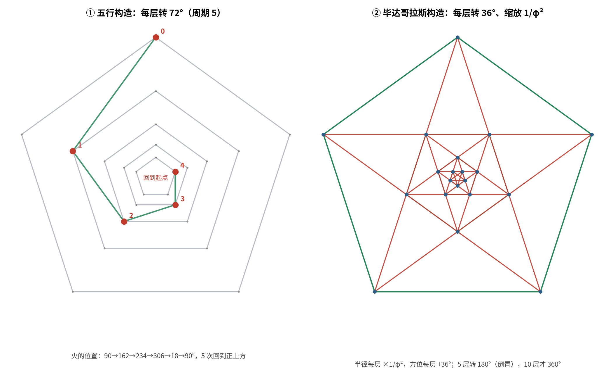
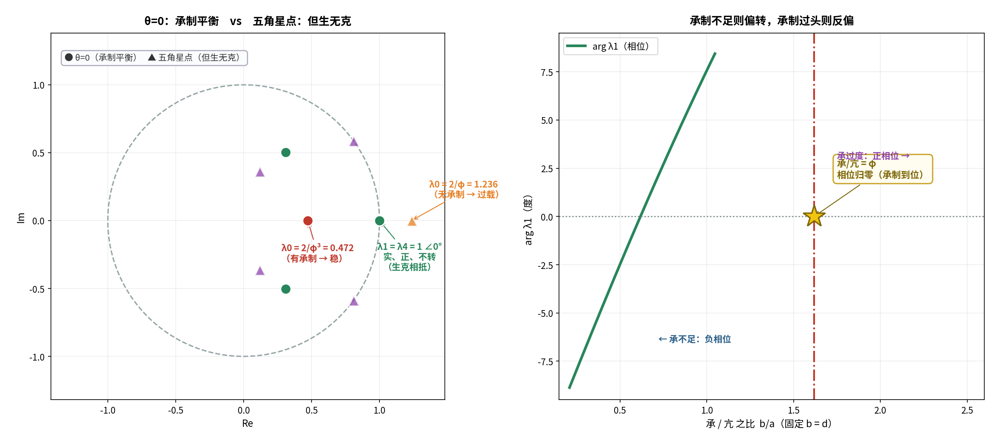

# 五行 · 毕达哥拉斯螺旋：读解工作总报告（可核查版）

**用途**：把截止 2026-09-17 的全部读解工作汇总成一份**可逐条核查**的报告。
**范围**：知识库的读解、论证、算例、对接四条线。
**方法**：先算后说（每条结论都附可复算的判据）+ 三层标注（严格 / 半严格 / 结构性）。

---

## 〇、这份报告怎么读

| 章 | 内容 | 用途 |
| :-- | :-- | :-- |
| 一 | **资料总览**（上游来源、文档、图、脚本、入库清单） | 核对"有什么" |
| 二 | **核心结论链**（六层，含标注等级） | 核对"结论是什么" |
| 三 | **关键数值与恒等式总表** | 抽验数字 |
| 四 | **已修正的错误留痕**（13 条） | 核对"哪些曾经错过" |
| 五 | **核查事项处理结果**（V1–V5 待裁决；**V10 审计已完成**） | 需要您裁决的点 + 已办结项 |
| 六 | **核查索引**（结论 → 文档 → 图 → 脚本） | 逐条溯源 |

---

## 一、资料总览（重新梳理）

### 1.1 上游来源（四类）

| 来源 | 性质 | 在本工作中的角色 |
| :-- | :-- | :-- |
| **原稿**（视频/文稿 + 图 1–10） | 直觉 + 演示图 | 被读解对象；结论多、论证少 |
| **元宝报告** | 三条文字的动力学/代数概括 | 外部对照；**发现 2 处谱半径错误** |
| **GitHub `wuxing-math（本项目）`** | 用户自建 v0.1（2026-09-12） | 对接对象（三项对接） |
| **知识库《五行数学结构·研究笔记 V2》等** | 既有笔记 | 术语与结构互证（`g, g², g³, g⁴`） |

### 1.2 workspace 文档（本主题相关，共 26 份）

**A. 主干读解（1）**
- `source-reading-geometry.md`

**B. 综合与评述（3）**
- `synthesis-geometry-and-dynamics.md`
- `commentary-on-yuanbao-report.md`
- `retrospective-contradiction-engine.md`

**C. 算例（3）**
- `worked-example-01-pentagram-step-algebra.md`
- `worked-example-02-critical-parameter-surface.md`
- `worked-example-03-nonlinearity-two-win.md`

**D. 收卷之作（1）**
- `dynamical-construction.md`（六层贯通）

**E. 仓库对接（4）**
- `reading-the-repo.md`
- `bridge-report-overview.md`
- `01-chirality-and-36deg.md`
- `01a-physical-reading-of-chi.md`

**F. 对接①续二 ~ 续十二（11）**
- 续二 幂格与奇偶分工｜续三 `R^n` 尺度进联合相图｜续四 相生临界线上的取舍
- 续五 总量饱和的两全点｜续六 两全面套上相图｜续七 三维三面共点
- 续八 θ0 点的物理意义｜续九 θ0 的中医对应｜续十 以平为期
- 续十一 双临界点的中医对应｜续十二 36° 线与双临界点

### 1.3 图（本主题 23 张，均在 `figures/`）

几何：`wuxing_pythagoras_nesting` / `wuxing_conical_spiral` / `wuxing_scale_invariance` / `pentagon_hierarchy_dsi` / `phi_powers_parity` / `chi_golden_ratio`
标度检验：`logperiodic_powerlaw` / `logperiodic_negative_test`
动力学：`wuxing_critical_spectrum` / `wuxing_nonlinear_choice` / `joint_phase_diagram` / `joint_phase_rscale` / `stability_region_ad`
对接：`line36_critical` / `line36_tradeoff` / `line36_vs_bicrit` / `nonlinear_twowin` / `cface_phase` / `three_surfaces`
中医：`theta0_meaning` / `chengzhi_pingren` / `pingweiqi` / `bicritical_tcm`
（另有 `physarum_network` / `physarum_shortestpath` 属黏菌线，非本主题）

### 1.4 可复算脚本（23 个，`make_*.py`）

`make_nesting_fig.py`（72° vs 36° 嵌套）｜`make_conical_fig.py`｜`make_scale_fig.py`｜`make_lppl_fig.py`（对数周期正检验）｜`make_test_fig.py`（负对照）｜`make_dsi_fig.py`（层级步闭环）｜`make_spectrum_fig.py`（临界参数面）｜`make_nonlin_fig.py`（两全非线性）｜`make_joint_phase.py` / `make_joint_phase2.py`（联合相图）｜`make_line36_fig.py`｜`make_tradeoff_fig.py`｜`make_twowin_fig.py`｜`make_cface_fig.py`｜`make_3d_fig.py`｜`make_parity_fig.py`｜`make_chi_fig.py`｜`make_theta0_fig.py`｜`make_chengzhi_fig.py`｜`make_pingweiqi_fig.py`｜`make_bicrit_fig.py`｜`make_line36vs_fig.py`

---

## 二、核心结论链（六层）

> **共同约定（V10·A10）**：以下各层的动力学结论，共用 `λ_k = (1−d) + a·ω^k − b·ω^(2k)`（`ω = e^(i72°)`）这一**线性约定**（见 D1）；模型本身是**构造性建模**（收卷之作 §八 已声明是"结构性"），非由五行推出。

### 第 1 层 · 几何（严格）

| # | 结论 | 判定 |
| :-- | :-- | :-- |
| G1 | 每层转 72°，5 次回归 ⟺ `R⁵ = I`（群 `C₅`）。**注：仅指循环次序的数学结构，不涉五行实质**（V10·A4） | **严格** |
| G2 | 正五边形：对角线 ÷ 边长 = `φ` | **严格** |
| G3 | 五角星自然内五边形：**36°/层、缩放 `1/φ²`、周期 10**（实算半径 0.38197、方位差 36°） | **严格** |
| G4 | 五行（72°）与五角星（36°）是**同族（同 `C₅`）而非同一条曲线**（同上，仅循环次序层面）（V10·A4） | **严格** |
| G5 | 三维轨迹 = **锥形对数螺旋**（俯视对数螺线 + 竖直线性） | **半严格**（`q` 待实测） |
| G6 | **螺旋 ≠ 循环**的判别准则：方位有周期（5）、径向无周期（**限 `q ≠ 1`**；`q = 1` 退化为闭轨）（V10·A5） | **严格** |



### 第 2 层 · 标度（严格 / 一处严格否定）

| # | 结论 | 判定 |
| :-- | :-- | :-- |
| S1 | `q^ℤ` **离散**标度不变（DSI）；"其小无内其大无外"需**双无限**尺度群 | **严格** |
| S2 | 对数周期 = **复临界指数**（定理：`f(qx)=q^α f(x)` ⟹ `f = Σ c_k x^(α+2πik/ln q)`） | **严格** |
| S3 | 本结构在 `ln r` 上等距（**步长 `= ln q`**；取 `q = 1/φ²` 时为 `−0.9624`。**"等距"严格，数值随 `q`**，`q` 待实测，见 V1）（V10·A1） | **严格** |
| S4 | **实检**：**本族**模型（定义见 `01-source-reading/generic-family-definition.md`；临界线 `a=d`）**没有**对数周期（目标频率处谱强度仅 0.13–0.18；正对照 0.997）。**否定只对本族成立**，非对一切 `C₅` 模型；且目标频率 `1/\|ln q\|` 依赖 `q`（V10·A2/A8） | **严格（否定结论）** |
| S5 | 诊断：**`C₅` 是"旋转"对称，不是"标度"对称** | **严格** |
| S6 | **闭环**：`T = 缩放 q ∘ 旋转 36°` ⟹ 调制周期 5；去掉旋转即归零 | **严格** |


### 第 3 层 · 动力学（严格）

> **前提（V10·A3）**：以下 D1–D7 均为**"给定该线性方程"下的严格结论**；而**"五行动力学就是这组方程"本身是构造性建模**（收卷之作 §八 已声明为"结构性"，需实测标定 `a, d, c`）。总报告此前遗漏了这条限定——这正是"§3.3 式"的同类失误：限定在源头有，汇总时没带上来。

| # | 结论 | 判定 |
| :-- | :-- | :-- |
| D1 | `λ_k = (1−d) + a·ω^k − b·ω^(2k)`，`ω = e^(i72°)` | **严格（约定）** |
| D2 | `M = q·R(36°)` 的特征值 `λ = q·e^(±i36°)`（`|λ| = 1/φ²`、`arg = 36°` 精确） | **严格** |
| D3 | `T² = q²·e^(i72°)` ⟹ **五角星步是相生步的平方根** | **严格** |
| D4 | **旋量双覆盖**：相生 5 步复原；五角星 5 步 180°、10 步复原 | **严格（代数）** |
| D4′ | "D4 与《旋量-太极》的 720° 双覆盖同构" | **结构性（比喻）**（V10·A6，原与 D4 混标一级） |
| D5 | 临界点闭式：`arg λ1 = 36°` 且 `|λ1| = 1` ⟹ **`a = 1/φ`、`d = 1/φ²`** | **严格** |
| D6 | 该点 `λ0 = 2/φ ≈ 1.236 > 1`——**过载**（= 原稿"只有相生会过载"） | **严格** |
| D7 | 稳定 ⟺ `d > a`（**限 `0 ≤ d ≤ 1`**；`d>1` 为过冲区，判据失效） | **严格（域内）** |

### 第 4 层 · 非线性（严格）

| # | 结论 | 判定 |
| :-- | :-- | :-- |
| N1 | `k=0`（均匀）与 `k=1`（图案）属**不同不可约表示** ⟹ 解耦 | **严格** |
| N2 | **总量饱和 `−c·X̄`**（只作用 `k=0`）可**两全**：`λ0 = 1`（稳）且 `λ1 = e^(i36°)` 分毫不动 | **严格** |
| N3 | 立方饱和 `−c\|x\|²x` 会产生**正比于 `A²`** 的相位漂移（因混合了表示）；**该参数下为 42.17°**（非普适常数）（V10·A7） | **严格** |
| N4 | `−c·X̄` 在 `x` 上是**线性 rank-1** 修正，不是真非线性 | **严格（澄清）** |

### 第 5 层 · 相图与两全（严格）

| # | 结论 | 判定 |
| :-- | :-- | :-- |
| P1 | `1/φ^k = q^(k/2)` 幂格：**偶 = 对角线/整数步/闭合；奇 = 边长/半整数步/旋量** | **严格** |
| P2 | `R^n = T^(2n)`，模 `1/φ^(4n)`，相位 `72n°`（相生/相克/相侮/子病及母） | **严格** |
| P3 | 五角星点封闭公式 `\|λ_k\| = (2/φ)·\|cos 36k°\|` | **严格** |
| P4 | 双临界点（`c=0`）= **(0.5356874, 0.1537214)**，`arg λ1 = 24.778652°` | **严格** |
| P5 | **36° 线**（`(a,b,d)` 中 1 参数曲线 `a + b = φd`）与双临界点**交于** `d = 2/(√5·φ)`，交点 `(φ/√5, 1/(√5·φ²))`，此处三条件同时成立 | **严格** |
| P6 | **一般定理（在线性更新下）**：`c = a − d ⟺ λ0 = 1`（与 `a, d` 无关）（V10·A9） | **严格** |
| P7 | 两全参数 `(a, d, c) = (1/φ, 1/φ², 1/φ³)`；且 `c = a − d = 1/φ³ = χ`（**四重恒等**） | **严格** |
| P8 | 套上 `c = a−d` 后 **`λ0 = 1 − b`**；均匀临界塌缩成 `b = 0` | **严格** |
| P9 | 三维：三面（`c=a−d` / `c=a−b−d` / `\|λ1\|=1` 柱面）**唯一共点** `(1/φ, 0, 1/φ³)` | **严格** |


### 第 6 层 · 中医对应（结构性）

| # | 对应 | 判定 |
| :-- | :-- | :-- |
| C1 | θ=0 点（生/克 `= 1/φ`、克 `= d`）= **「亢则害，承乃制」**（《素问·六微旨大论》） | **结构性** |
| C2 | 同点 = **「阴阳匀平……命曰平人」**（《素问·调经论》） | **结构性** |
| C3 | **「承」≡ 相克项 `b`；「亢」≡ 相生项 `a`**（经文本身列了五条"承"） | **结构性** |
| C4 | 五角星点（`b=0`）= **「害则败乱，生化大病」**（无承制 ⟹ 过载） | **结构性** |
| C5 | 双临界点（`c=0`）= **「平而不律」**（准周期，非五行节律） | **结构性** |
| C6 | `c·X̄` = **「脾者土也，治中央……孤藏以灌四傍」**（只动 `k=0`，图案里"善者不可得见"） | **结构性** |
| C7 | 沿不转射线：`a<d/φ` 不及｜`=d/φ` 平｜`>d/φ` 太过（**「以平为期」**） | **结构性** |



---

## 三、关键数值与恒等式总表（抽验用）

### 3.1 基本常数

| 量 | 值 |
| :-- | :-- |
| `φ` | 1.618033988749895 |
| `1/φ` | 0.618033988749895 |
| `1/φ²`（= `q`） | 0.381966011250105 |
| `1/φ³` | 0.236067977499790 |
| `2/φ` | 1.236067977499790 |
| `√5` | 2.236067977499790 |
| `2/√5` | 0.894427190999916 |
| `ln q` | −0.962423650119207 |
| `2 sin 36°` | 1.175570504584947 |

### 3.2 关键恒等式（全部可独立验算）

```
x² + x = 1                     的根 x = 1/φ
1/φ + 1/φ² = 1
1/φ − 1/φ² = 1/φ³ = (1/φ)(1/φ²)
2/φ  = 1 + 1/φ³
1/φ + 1/φ³ = √5/φ² = 0.8541019662
4 sin²36° = 3 − φ = 1.3819660113
ω − φω² = φ                        （ω = e^(i72°)，纯实）
sin144°/sin72° = 1/φ
|1 + e^(i72°)| = φ，arg = 36°
(1/φ²)² + (2 sin36°)² = (2/φ)²
2 − 1/φ = 1 + 1/φ² = 1.3819660113   （≠ φ，易错）
```

### 3.3 关键参数点

| 点 | 坐标 | 相位 | 含义 |
| :-- | :-- | :-- | :-- |
| **五角星点** | `(1/φ, 0)` | 36° | `\|λ0\| = 2/φ`（过载）；36° 线与相生临界线的交点 |
| **双临界点（`c=0`）** | `(0.5356874, 0.1537214)` | 24.778652° | `\|λ0\| = \|λ1\| = 1`；准周期 |
| **三条件共点** | `(φ/√5, 1/(√5φ²))`，`d = 2/(√5φ)` | 36° | `\|λ0\|=\|λ1\|=1` 且 36° |
| **两全点** | `(a,d,c) = (1/φ, 1/φ², 1/φ³)` | 36° | `λ0 = 1`、`λ1 = e^(i36°)` |
| **θ=0 点** | `(a,b) = (1/φ³, 1/φ²)` | 0° | 生/克 `= 1/φ` 且 克 `= d` |
| **稳定域** | `\|λk\| ≤ 1`（∀k） | — | 占参数框 17.0% |

---

## 四、已修正的错误留痕（审计用，13 条）

| # | 错误 | 性质 | 处置 |
| :-- | :-- | :-- | :-- |
| 1 | 元宝报告称 `ρ(S+K) = 1`、`ρ(S−K) = 1` | **外部来源错误** | 复算：`2.000` 与 `1.902`；其代码 `K[-2:,:2]=1` 有 bug |
| 2 | 元宝报告把 `K` 当作 `S²` 的正确编码 | 外部来源错误 | 已在《commentary-on-yuanbao-report》逐条指出 |
| 3 | 初稿把"五行 72°"与"五角星 36°"并成一件 | 本工作修正 | 区分两种嵌套（§二 G4） |
| 4 | 网络示意图"交叉点 a"与副标题重叠 | 制图缺陷 | 重排版，节点名一律放节点下方 |
| 5 | 技能注册报 `invalid skill format` | 工具链缺陷 | 根因 = node_modules + package.json + 平台符号链接 |
| 6 | zip 打包出现 `math-doc-rigor/math-doc-rigor/` 嵌套 | 打包缺陷 | 打包须跳过符号链接与 node_modules |
| 7 | matplotlib 中文字形缺失（`⟹`、下标 `λ₁`） | 渲染缺陷 | 改用 `→`、`λ1`；本报告全程遵守 |
| 8 | 平台 `fetch` 对同一 URL 抽取时**重复段落** | 工具假象 | 以 curl 下载原文为准 |
| 9 | `w**2 .real` 被解析为 `w ** (2).real` | **本轮算错** | 导致实解算成复解；已修正并复算 |
| 10 | 误用 `2 − 1/φ = φ` | **本轮算错** | 实为 `1 + 1/φ²`；修正后才得正确的 `d = 2/(√5φ)` |
| 11 | `R^n` 的模一度写作 `1/φ^(2n)` | 本工作修正 | 应为 `1/φ^(4n)`（五行一步 = 本征步的两次） |
| 12 | **§3.3 稳定阈值写成无条件的「稳定 ⟺ `d > a`」并标为严格** | **外部核查发现（2026-09-17，感谢核查）** | 只在 `d ≤ 1` 成立；`d>1` 时最大特征值移到 `k=2,3`，判据被击穿。已改标「严格（域内）」+ 补分段条件与上界 `u(a)` + 加图 `stability_region_ad.png` |
| 13 | **收卷之作已声明"五行动力学是构造性建模"，总报告 D 层汇总时丢了这条限定**（V10·A3） | **汇总遗漏（与 #12 同型：源头有、汇总无）** | 已在 §二 第 3 层加表头前提；并执行 V10 全部 10 条前提补丁（§5.2） |

**另有两条"易混点"已显式标注**：
- **`c = 0` 相图（均匀临界是斜线）** 与 **`c = a−d` 相图（塌缩成 `b=0`）** 不可混用；
- **`C₅` 的相位（72°）** 与 **本征步的相位（36°）** 不可混用（差一个旋量因子 2）。
- **`d > a` 的稳定性判据只在 `0 ≤ d ≤ 1` 成立**——`d > 1` 是**过冲区**（`1−d < 0` 使状态反号），判据失效。

---

## 五、核查事项处理结果

### 5.1 仍需您裁决（学术性）

| # | 事项 | 现状 | 需要什么 |
| :-- | :-- | :-- | :-- |
| V1 | **`q` 的实测值** | 几何骨架取 `1/φ²` | 原稿图上是否有实测数可校准 |
| V2 | **`C₅` 无标度对称**（导致 DSI 必须显式装入） | 严格结论 | 是否符合您对"五行 = 标度"的预期 |
| V3 | **中医映射全部为"结构性"** | 已标注 | 是否需要提升为可检验命题 |
| V4 | **`b = d` 还是 `b ≥ d`** | `=` 是"中性"唯一解 | 中医上"承制"是否允许有余 |
| V5 | **`√5` 的来源**（`a + b = 2/√5` 反复出现） | 未解 | 是否值得单开一问 |

### 5.2 已完成：V10 隐含前提审计

**缘起**：2026-09-17 外部核查发现 §3.3 的稳定阈值依赖一个未声明的域假设（`d ≤ 1`）。据此把六层 **34 条"严格"结论逐条写成「前提 ⟹ 结论」**，检查**前提是否写在明处**。

| 严重度 | 条数 | 含义 |
| :-- | :-- | :-- |
| **高** | 3 | 前提缺失会**改变结论的适用范围或数值** |
| **中** | 5 | 前提缺失会让读者**高估结论强度** |
| **低** | 2 | 表述规范问题 |

**结论**：**没有第二条"§3.3 式"硬错误**（不存在"标严格但实际不成立"的结论）；但发现 **10 处前提未写在明处**——

| # | 涉及 | 缺的前提 | 处置 |
| :-- | :-- | :-- | :-- |
| A1 | S3 | `q = 1/φ²` 是**建模取值、非实测** | 已加注"取 `q=1/φ²` 时；`q` 待实测"（并入 V1） |
| A2 | S4 | "generic 族"**未定义** | 已改为"**本族**模型"并指向 `01-source-reading/generic-family-definition.md` |
| **A3** | **D2–D7** | **模型本身是构造性建模，非推导** | **§二 第 3 层已加表头前提**（收卷之作 §八 早有声明，本次汇总继承） |
| A4 | G1/G4 | 只指**循环次序**，不涉五行实质 | 已在 G1/G4 加注 |
| A5 | G6 | 预设 `q ≠ 1` | 已加"限 `q ≠ 1`" |
| A6 | D4 | 一条里装了两个等级 | 已拆为 D4（代数·严格）+ D4′（同构·结构性） |
| A7 | N3 | `42.17°` ∝ `c·A²`，**参数依赖** | 已改为"正比于 `A²` 的漂移（该参数下为 42.17°）" |
| A8 | S4/S6 | 谱检验目标频率 `1/\|ln q\|` 依赖 `q` | 已与 A1 合并说明 |
| A9 | P6–P9 | 预设**线性**更新 | P6 已注明"在线性更新下" |
| A10 | §二 | 线性约定未集中声明 | §二 开头已加"共同约定" |

> **A1–A10 不改变任何结论的数学内容**，只改变"这些结论在多大范围内成立"的表述。
> 完整版见 `审计_隐含前提_五行毕氏螺旋.md`（打包名 `06-audit/implicit-premises-audit.md`）。

---

## 六、核查索引（结论 → 文档 → 图 → 脚本）

| 结论 | 文档 | 图 | 可复算脚本 |
| :-- | :-- | :-- | :-- |
| G1–G4 | source-reading-geometry §一–§三；综合报告 §二 | `wuxing_pythagoras_nesting` | `make_nesting_fig.py` |
| G5–G6 | 读解 §九–§十一 | `wuxing_conical_spiral` | `make_conical_fig.py` |
| S1–S3 | 读解 §十三–§十四 | `wuxing_scale_invariance` | `make_scale_fig.py` |
| S4–S5 | 读解 §十五 | `logperiodic_negative_test` | `make_test_fig.py` |
| S6 | 读解 §十六 | `pentagon_hierarchy_dsi` | `make_dsi_fig.py` |
| D1–D7 | 算例二；dynamical-construction §四 | `wuxing_critical_spectrum` | `make_spectrum_fig.py` |
| N1–N4 | 算例三；收卷之作 §五 | `wuxing_nonlinear_choice` | `make_nonlin_fig.py` |
| P1 | 对接①续二 | `phi_powers_parity` | `make_parity_fig.py` |
| P2 | 对接①续三 | `joint_phase_rscale` | `make_joint_phase2.py` |
| P3 | 对接①续三 | `joint_phase_rscale` | 同上 |
| P4–P5 | 对接①续十一、续十二 | `bicritical_tcm` / `line36_vs_bicrit` | `make_bicrit_fig.py` / `make_line36vs_fig.py` |
| P6–P9 | 对接①续五、续六、续七 | `nonlinear_twowin` / `cface_phase` / `three_surfaces` | `make_twowin_fig.py` / `make_cface_fig.py` / `make_3d_fig.py` |
| C1–C7 | 对接①续九、续十、续十一 | `chengzhi_pingren` / `pingweiqi` / `bicritical_tcm` | `make_chengzhi_fig.py` / `make_pingweiqi_fig.py` |
| 手性与 36° | 对接①；对接①续；续八 | `line36_critical` / `chi_golden_ratio` / `theta0_meaning` | `make_line36_fig.py` / `make_chi_fig.py` / `make_theta0_fig.py` |

---

## 七、一句话总结

> **原稿抓住的是 `C₅` 这个对称群和它必然携带的 `φ`——这是真的、可算的。**
> 但 **"五行 = 毕达哥拉斯螺旋"作为等式不成立**（72° 嵌套 vs 36° 嵌套，同族而非同曲线）；
> **"螺旋上升最稳定"也不是普适定律**，其受控版本是 `d > a`（**限 `0 ≤ d ≤ 1`**）。
> **真的新东西在动力学层**：`1/φ^k` 三幂配齐三个角色，
> **两全参数 `(a,d,c) = (1/φ, 1/φ², 1/φ³)`，且 `c = a − d = χ`。**

---

*报告版本：v1.2（2026-09-17 勘误：D7 稳定阈值限定 `0≤d≤1`，补分段条件与上界；更新：并入 V10 隐含前提审计结果——新增 §5.2、§四#13，并落实 A1–A10 的 10 条前提补丁）*
*时间：2026-09-17*
*方式：资料盘点（脚本化）+ 结论抽取 + 三层标注 + 错误留痕 + 核查索引*
*上游：本主题全部 26 份文档、23 张图、23 个脚本；知识库 05 目录 63 项（已重构为 9 个子文件夹 + 1 份目录说明）*
