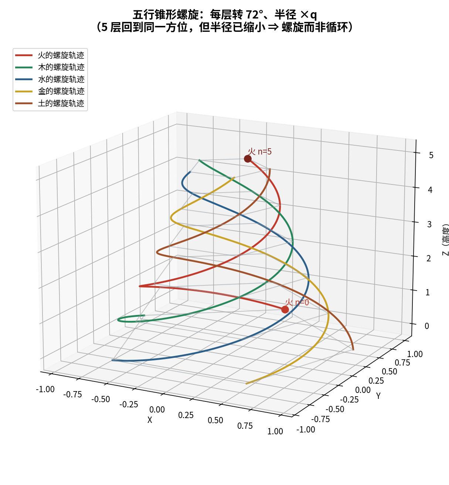
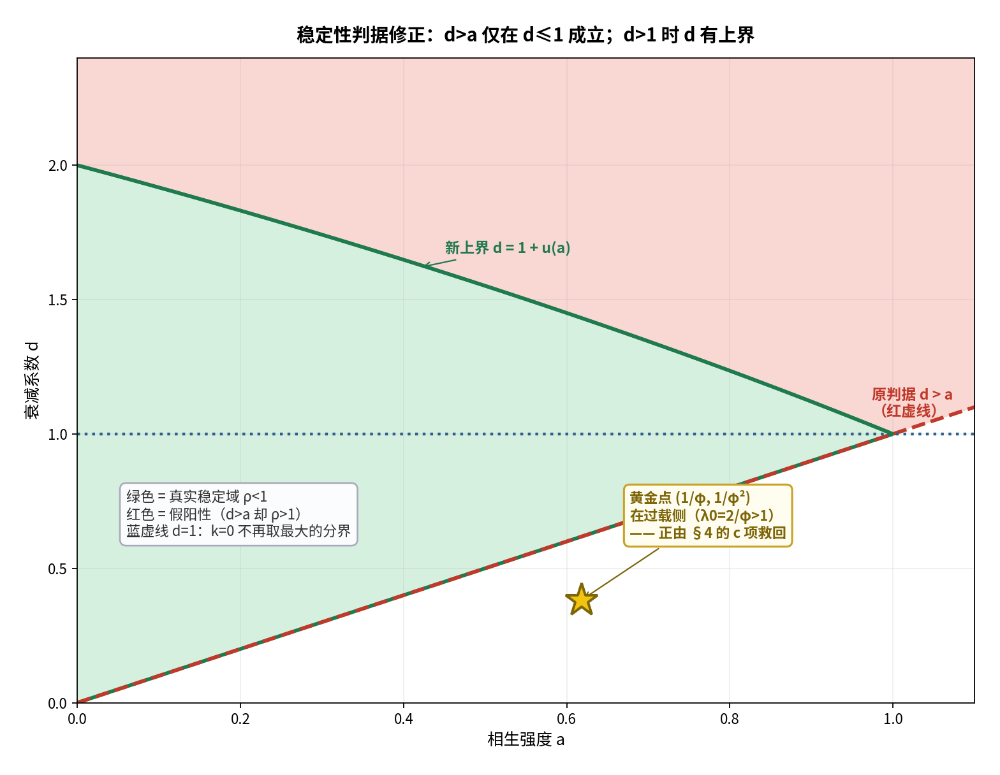

# 五行 · 毕达哥拉斯螺旋：综合研究报告

**——几何事实 + 动力学判据 + 三方对照**

**材料**：知识库「毕达哥拉斯螺旋」（主文档 + 6 张图）
**方法**：先算后说（逐条复算）+ 三层标注（严格 / 半严格 / 结构性）

---

## 〇、一页摘要

| 层面 | 结论 | 判定 |
| :-- | :-- | :-- |
| **几何** | 每层转 72°，5 次回归（`R⁵=I`，`C₅`） | **严格** |
| 几何 | 正五边形 对角线/边长 = φ | **严格** |
| 几何 | 五角星自然递归 = **36°/层、缩放 1/φ²、周期 10**（≠ 72°） | **严格** |
| 几何 | 三维轨迹 = 锥形对数螺旋 | **半严格** |
| 几何 | **方位周期 5 ≠ 径向周期** ⟹ 螺旋而非循环 | **严格** |
| **动力学** | 相生 = 5-循环置换阵 `S`；相克 = `S²`；`S⁵=I` | **严格** |
| 动力学 | `ρ(S)=ρ(K)=1`（临界周期）；`ρ(S±K)>1`（发散） | **严格（实算）** |
| 动力学 | "相克自动带来稳定" | **❌ 不成立** |
| 动力学 | 真稳定 ⟺ **衰减 d > 相生 a**（限定 `0≤d≤1`） | **严格（域内）** |
| **总** | "五行 **=** 毕氏螺旋" | **❌ 等式不成立；同族 `C₅` 成立** |

---

## 一、材料与三方来源

原稿讲的是**几何**（五边形嵌套、72°、五角星、黄金比、锥形螺旋）。围绕它出现了三份解读：

| 来源 | 输入 | 特长 | 局限 |
| :-- | :-- | :-- | :-- |
| **原稿（视频/文稿）** | — | 直觉 + 演示图 | 结论多、论证少 |
| **元宝报告** | 三条**文字**概括 | 动力学/代数（有据、可复现） | **没有图** → 触不到几何 |
| **本报告** | 文字 **+ 6 张图** | **几何** | 需外部补动力学 |

→ 三者**互补**，交汇点是同一个 **`C₅`**。

---

## 二、几何部分（可算的事实）

### 2.1 72° 与五次回归 —— 严格

正五边形的旋转对称群是 `C₅`，生成元 = `2π/5 = 72°`，故 `R⁵ = I`。

验算（火自 90° 起，每层 +72°）：`90 → 162 → 234 → 306 → 18 → 90`。
**与图中表格逐格吻合**；`5×72° = 360° ≡ 0` ⟹ 第五次回到正上方。

### 2.2 黄金比例 —— 严格

正五边形恒等式：**对角线 / 边长 = φ**（`φ = (1+√5)/2 ≈ 1.61803`）。

用图 8 数值反算（取 `R = 3`）：边长 `3.5267`、对角线 `5.7063`、差 `2.1796`
—— 与标注 **3.526 / 5.701 / 2.175** 吻合（残差仅舍入）；且 `d/s = s/(d−s) = φ`。

### 2.3 ★ 自相似嵌套：**72° 与 36° 是两种嵌套** —— 严格（本文实算）

原稿把两件事并成了一件。实算五角星的自然内五边形（把对角线按黄金分割取内点）：

| | 五行构造（图 3/4/5） | 五角星（图 7，毕达哥拉斯） |
| :-- | :-- | :-- |
| 每层旋转 | **72°** | **36°**（= 72°/2，"倒置"） |
| 每层缩放 | 等比 | **1/φ² ≈ 0.38197** |
| 回归周期 | **5** | **10** |
| 对称群 | `C₅` | `C₅`（同群，取元不同） |

（实算：内五边形半径 = 0.38197 = 1/φ²；方位角 126°/198°/270°/342°/54°，与外层逐点相差 36°。）


### 2.4 三维"锥形螺旋" —— 半严格

每层：半径 `r_n = R₀·qⁿ`、方位 `θ_n = 72°·n`、高 `z_n = h·n`。
令 `n = θ/72°` 消去层号（连续化唯一）：

```
r(θ) = R₀·e^(bθ),  b = ln q/(72°)   ← 俯视：对数螺线
z(θ) = (h/72°)·θ                    ← 竖直：线性上升
```

⇒ **锥形对数螺旋**（图 3/4/5 是离散骨架，图 6/10 是连续外形）。



### 2.5 ★ "螺旋 ≠ 循环"的判别准则 —— 严格（本文新增）

| n | 方位 | 半径 |
| :-- | :-- | :-- |
| 0 | 90° | 1.00000 |
| 5 | **90°** | **0.32768** |
| 10 | **90°** | 0.10737 |

**方位有周期（5），径向无周期（`r` 持续缩小）⟹ 轨迹永不闭合。**
> 这就是"循环 → 螺旋"的**判别准则**：**循环 = 闭轨（回到同一点）；螺旋 = 回到同一方位、但落在不同半径。**

### 2.6 "其小无内，其大无外" —— 结构性

构造对 `T =（旋转 72°, 缩放 q）` 不变 ⟹ 无"最小层/最大层"。
对**理想构造严格**；对**物理**五行（有人尺度、有截断）为**尺度不变的有效模型**（结构性）。

---

## 三、动力学部分（`C₅` 与谱）

### 3.1 矩阵编码 —— 严格

固定顺序 `(木,火,土,金,水)=(0,1,2,3,4)`：
**相生** `S` = 步长 1 的循环置换阵；**相克** `K = S²`（步长 2）；`S⁵ = I`。
> 这与本知识库《五行的数学结构》一致：相生 = `g`、相克 = `g²`、相侮 = `g³`、子病及母 = `g⁴`。

特征值：`σ(S) = {ω^k}`，`σ(K) = {ω^(2k)}`，`ω = e^(2πi/5)` → `ρ(S) = ρ(K) = 1`。

### 3.2 四种编码的谱半径 —— 严格（复算）

| 模型 | 含义 | `ρ` | 长期行为 |
| :-- | :-- | :-- | :-- |
| `S` | 纯相生 | **1.000** | 精确 5-周期（守恒搬运） |
| `K` | 纯相克 | **1.000** | 精确 5-周期（**不等于崩溃**） |
| `S+K` | 生克边并存 | **2.000** | **发散** |
| `S−K` | 生克相减 | **1.902** | **发散**（`\|λ\| ∈ {0, 1.176, 1.902}`） |

> ⚠️ **对元宝报告的两处勘误**：它称 `S+K` "仍是置换矩阵、`ρ=1`"、`S−K` "实正交对称、特征值 `±1,0`、`ρ=1`"。
> 实算**都不是**：`S+K` 每行有**两个 1**，**不是**置换阵；`S−K` 满足 `(S−K)ᵀ(S−K) ≠ I`。
> 其**代码** `K=np.eye(5,k=2); K[-2:,:2]=1` 也有 bug（K 的两行相同）。
> 结论方向不变（更不稳），但"临界 `ρ=1`"是错的。

### 3.3 什么才真稳定？—— **严格（修正版：限定 `d ≤ 1`）**

带衰减的模型：`A = (1−d)I + aS`，特征值 `λ_k = (1−d) + a·ω^k`。

令 `c = 1−d`，则 `|λ_k|² = c² + a² + 2ac·cos(2πk/5)`。
**最大值落在 `k=0` 与否，取决于 `ac` 的符号**：

```
ac ≥ 0（即 d ≤ 1）:  max 在 k=0    ⟹ ρ = |1 − d + a|
ac < 0（即 d > 1）:  max 在 k=2,3  ⟹ ρ² = (d−1)² + a² + φ(d−1)a
```

**完整条件（`a ≥ 0`）**：

```
0 ≤ d ≤ 1         :  ρ < 1  ⟺  d > a
1 < d < 1 + u(a)  :  ρ < 1  ⟺  d − 1 < u(a)
                         u(a) = [ √(4 − (3−φ)a²) − φa ] / 2     （仅 a < 1 才有正解）
```

**模型域**：`d` 是"衰减系数"（`x → (1−d)x`），语义上取 **`0 ≤ d ≤ 1`**——
`d > 1` 时 `1−d < 0`，一步就让状态反号，那是**过冲**，不是"衰减更强"。
在此域内，结论成立：

```
ρ(A) < 1  ⟺  d > a        （d = a 为临界）
```

数值验证：`d=0.30, a=0.20 → ρ=0.90` ✓；`d=0.20, a=0.30 → ρ=1.10` ✗；`d=a → ρ=1`（临界）。

> **⚠️ 勘误（2026-09-17，v1.2 修订）**：本节初稿把结论写成**无条件**的"稳定 ⟺ `d > a`"并标为**严格**。
> 该结论**只在 `d ≤ 1` 成立**——`d > 1` 时最大特征值移到 `k=2,3`，判据被击穿。
> 反例（复算通过）：`a=0.4, d=2.2 → ρ=1.54164`；`a=1.0, d=2.0 → ρ=1.90211`；`a=0.0, d=2.1 → ρ=1.10000`
> —— **三条都满足 `d > a`，却都发散**。
> 现改为 **「严格（限定 `0 ≤ d ≤ 1`）」**，并补上完整分段条件与上界 `u(a)`。
>
> **下游结论不受影响**：本工作用到的参数一律在 `d ≤ 1` 域内（黄金模型 `d = 1/φ² ≈ 0.382`）。



> 这条给出"有制约才稳定"的**正确形式**：不是"存在相克"，而是"**衰减强于产生**"（在 `d ≤ 1` 域内）。

---

## 四、三方对照

| # | 命题 | 原稿 | 元宝 | 本报告 |
| :-- | :-- | :-- | :-- | :-- |
| 1 | 每层 72°、5 次回归 | 提出 | ✅（未算） | **✅ 实算 `R⁵=I`** |
| 2 | 黄金比例 | 提出 | 未涉及 | **✅ 反算图 8** |
| 3 | 自相似嵌套 | 提出（混同） | 未涉及 | **✅ 区分 72°/36°** |
| 4 | 锥形螺旋 | 提出 | 未涉及 | **✅ 给出模型** |
| 5 | 相生相克 = `C₅` | 隐含 | ✅ | **✅（与 KB 一致）** |
| 6 | 相克自动稳定 | 主张 | ❌ | **❌ 不成立** |
| 7 | 螺旋上升最稳定 | 主张 | ❌ | **❌ 非普适；受控版为 `d>a`（限 `0≤d≤1`）** |
| 8 | 五行 **=** 毕氏螺旋 | 主张 | ❌ | **❌ 等式；✅ 同族 `C₅`** |
| 9 | 毕氏螺旋 = Theodorus？ | （正文指五角星） | ⚠️ 歧义提醒 | **正文已消歧 = 五角星** |

---

## 五、合成判定表

| 主张 | 判定 | 依据 |
| :-- | :-- | :-- |
| 每层转 72°、5 次回归 | **严格** | `C₅` / `R⁵=I` + 表格验算 |
| 对角线/边长 = φ | **严格** | 正五边形定理 + 图 8 反算 |
| 五角星递归 = 36°、1/φ²、周期 10 | **严格** | 本文实算 |
| 五行构造与五角星"同族" | **半严格** | 同 `C₅`，转角差一倍 |
| 轨迹 = 锥形对数螺旋 | **半严格** | 连续化唯一；`q` 待实测 |
| **螺旋 ≠ 循环**（方位周期 ≠ 径向周期） | **严格** | 本文判别准则 |
| 相生/相克 = 置换阵、`S⁵=I` | **严格** | 与 KB 互相印证 |
| 相克自动稳定 | **❌** | `ρ(S±K) > 1` 反例 |
| 稳定 ⟺ `d > a`（限 `0≤d≤1`） | **严格（域内）** | 分段条件 + `figures/stability_region_ad.png` |
| "其小无内，其大无外" | **结构性** | 理想严格，物理为有效模型 |
| 五行 = 毕达哥拉斯螺旋 | **❌ 等式**；**✅ 同族** | 72° vs 36° |

---

## 六、结论与未决

### 结论

1. **原稿抓住的是 `C₅` 这个对称群，以及它必然携带的 φ。** 这是真的、可算的。
2. **"五行 = 毕达哥拉斯螺旋"作为等式不成立**——五行是 72° 嵌套、五角星是 36° 嵌套；
   它们是**同族（同 `C₅`）而非同一条曲线**。
3. **"螺旋上升最稳定"不是普适定律**；其**受控版本**是：在有衰减的模型里，**`d > a`（限 `0≤d≤1`）才稳定**（`d>1` 为过冲区，判据失效）。
4. **"螺旋 ≠ 循环"有严格判别准则**：方位周期 `5`，径向无周期 ⟹ 永不闭合。

### 未决（需要新的输入）

1. 原稿每层的**半径比 `q`** 是多少？（决定螺旋的 `b`；图 6/10 未标数值。）
2. 若要与五角星"合流"，需要说明为何取 72°（=`2×36°`）而非 36°——是**建模选择**还是**有别的依据**？
3. 动力学中的 `d, a, β`（衰减、相生、相克系数）有无**实测/可观测对应**？

---

### 附：本报告生成的图

- `figures/wuxing_pythagoras_nesting.png` —— 五行 72° 嵌套 vs 五角星 36° 嵌套（对照）
- `figures/wuxing_conical_spiral.png` —— 三维锥形螺旋（五元素轨迹）

---

*报告版本：v1.2（2026-09-17 勘误：§3.3 稳定阈值限定 d≤1）*
*时间：2026-09-17*
*方式：先算后说（`R⁵=I`、图 8 反算、内五边形 36°/1/φ² 实算、`S/K/S±K` 谱半径复算、稳定阈值推导）+ 三层标注*
*上游：五行和毕达哥拉斯螺旋.md（原稿）、五行与数学公式读解研究.md（元宝）、五行的数学结构（KB）*
