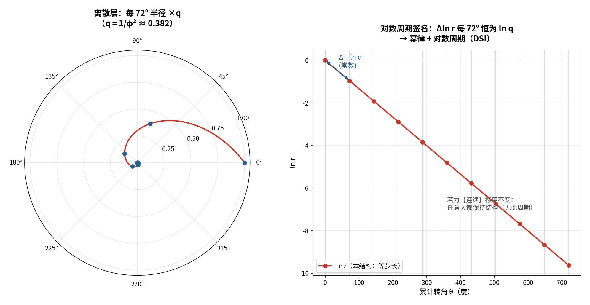
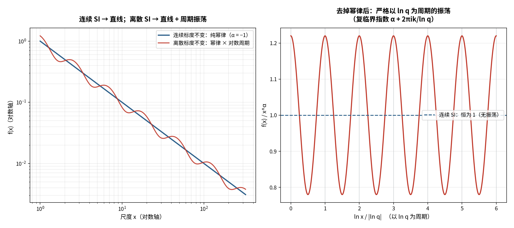
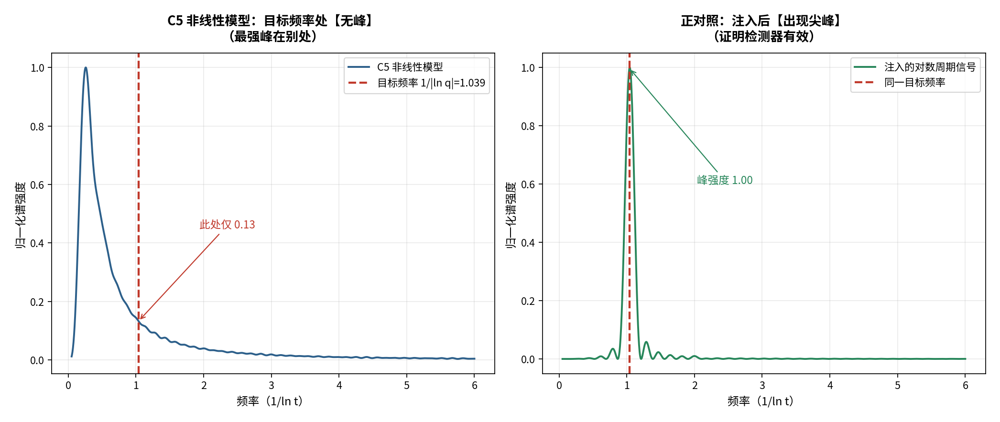
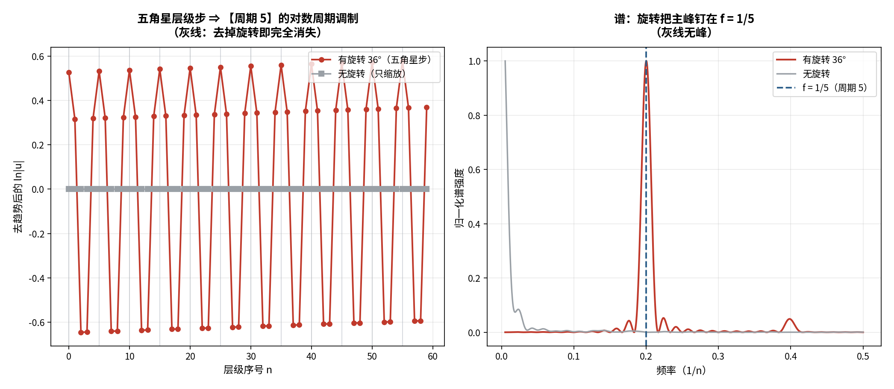

# 读解：五行和毕达哥拉斯螺旋 —— 几何层面的数学论证

**材料来源**：知识库「毕达哥拉斯螺旋」（主文档 + 6 张几何图）
**方式**：先算后说（逐条数值验算）+ 三层标注（严格 / 半严格 / 结构性）

---

## 〇、原文主张了什么

1. 五行是"周而复始的循环"**之上**的螺旋上升结构；
2. **每放大/缩小一次，五行整体旋转 72°**；五次后各元素回到原方位（以火为例：90°→…→90°）；
3. 五边形顶点相连可"一直往下分到无限小"、往外"拓展到无穷大"——**其小无内，其大无外**；
4. 这与毕达哥拉斯的**五角星自相似嵌套**（黄金比、无限递归）"如出一辙"，与**对数螺旋高度相似**；
5. 结论：这不是哲学巧合，而是**东西方抵达的同一真相**。

下面**逐条验算**。

---

## 一、论证 1：72° 旋转与五次回归 —— **严格成立** ✅

**几何根源**：正五边形的旋转对称群是 `C₅`，其生成元就是旋转 `2π/5 = 72°`。
旋转 `R` 满足 `R⁵ = I`（五次方为单位元）。

**验算**（火从 90° 起，每层 +72°）：

| 层 | 0 | 1 | 2 | 3 | 4 | 5 |
| :-- | :-- | :-- | :-- | :-- | :-- | :-- |
| 火的角度 | 90° | 162° | 234° | 306° | 18° | **90°** |

计算 `(90 + 72k) mod 360`：**与图中表格逐格吻合**。第 5 层回到 90°（正上方）——正是 `5×72° = 360° ≡ 0`。

> **判定：严格。** 这是 `C₅` 群论的一条直接推论，无任何近似。

---

## 二、论证 2：黄金比例 —— **严格成立** ✅

正五边形有恒等式：**对角线 / 边长 = φ**（`φ = (1+√5)/2 ≈ 1.61803`）。

**用图 8 的数值反算**（取外接半径 `R = 3`）：

| 量 | 公式 | 计算值 | 图 8 标注 |
| :-- | :-- | :-- | :-- |
| 边长 `s` | `2R sin36°` | 3.5267 | **3.526** ✓ |
| 对角线 `d` | `2R sin72°` | 5.7063 | **5.701** ✓（舍入） |
| 差 `d − s` | — | 2.1796 | **2.175** ✓ |

比例验证：`d/s = 1.61803 = φ`，`s/(d−s) = 1.61803 = φ`。

> **判定：严格。** 并对图 8 的数值做了**独立反算**——三条线段之比精确等于 φ（残差仅来自显示舍入）。

---

## 三、论证 3：自相似嵌套 —— **成立，但必须区分两种嵌套** ⚠️（关键修正）

这是全文**最需要澄清**的一处。原稿把两件事并成了一件：

### (a) 五行构造（图 3/4/5）：**72° / 层**，周期 5

同心五边形 + 等比缩小，**每层整体转 72°**。
→ 对应群 `C₅`，`R⁵ = I`，周期 **5**。

### (b) 毕达哥拉斯的五角星（图 7）：**36° / 层**，缩放 `1/φ²`，周期 10

我**实际算了一遍**：外五边形顶点取 `90° + 72k`，把对角线按黄金分割（内点 = `V_k + (1/φ²)(V_k+2 − V_k)`），得到的**内五边形**：

| 量 | 计算值 | 说明 |
| :-- | :-- | :-- |
| 内五边形半径 | **0.38197** | `= 1/φ² ≈ 0.38197` ✓ |
| 内五边形方位角 | 126°, 198°, 270°, 342°, 54° | 与外层逐点相差 **36°** |

（外层方位角为 90°, 162°, 234°, 306°, 18° —— 内层恰好**每点错开 36°**，即"倒置"。）

→ 五角星的递归是 **36° / 层**，不是 72°。
→ `5 × 36° = 180°`（方向翻转），**10 层才 360° 回归**。

### 对照

| | 五行构造（原稿） | 五角星（毕达哥拉斯） |
| :-- | :-- | :-- |
| 每层旋转 | **72°** | **36°** |
| 每层缩放 | 等比（未指明比值） | **1/φ²** |
| 回归周期 | **5** | **10** |
| 对称群 | `C₅` | `C₅`（同一群，生成元取法不同） |

> **判定：半严格。** "自相似、可无限递归"**成立**（这是构造的直接性质）；
> 但原稿"五行结构由此类比毕达哥拉斯"这一步是**跳步**——两者虽同属 `C₅`，
> **每层转角相差一倍**（72° vs 36°），不能直接等同。

补图对照见：`figures/wuxing_pythagoras_nesting.png`（左：五行 72°；右：五角星 36°+1/φ²）。

---

## 四、论证 4：与"对数螺旋"的相似 —— **需降级表述** ⚠️

**对数螺旋** `r = a·e^{bθ}` 的定义性质：旋转 `Δθ` 同时缩放 `e^{bΔθ}`——即**自相似/缩放不变**。

### 关键澄清（原稿未言明的两件事）

1. **"缩放不变性"是自动的，不是发现。**
   只要"**定比缩放 + 定角旋转**"逐层做，得到的点列**必然**落在**某条**对数螺旋上。
   所以"五行轨迹是对数螺旋"**并不**构成它与黄金螺旋"相似"的证据——**任何**等比嵌套都满足。

2. **参数并不相同。** 对数螺旋由 `b` 唯一刻画：

| 结构 | 每层 (缩放, 转角) | `b = ln(q)/Δθ` | 数值 |
| :-- | :-- | :-- | :-- |
| 标准**黄金螺线** | ×φ, 90° | `2 lnφ / π` | **+0.306** |
| **五角星嵌套** | ×φ⁻², 36° | `−10 lnφ / π` | **−1.532** |

（五行构造若取 `q = φ⁻²`、`72°/层`，则 `b = −0.766`。）

三者的 `b` 数值相差数倍、甚至**符号相反**——它们是**三条不同的对数螺旋**。

> **判定：半严格（原表述需降级）。** 正确说法是：
> "五行嵌套的轨迹**是一条对数螺旋**（自相似）；它与黄金螺旋**同族**（都是对数螺旋），
> 但因**缩放比与转角不同**而**并非同一条曲线**。"
> 原稿"高度相似"是**修辞**，不是几何结论。

---

## 五、论证 5：相生相克 → 稳定场 —— **结构性（可代数化）**

原稿：只有相生会"一直滚动"→ 过载；加相克才有"制约/稳定场"。

用**已有的代数结果**可精确表达（与本知识库《五行的数学结构》一致）：

- 相生 = 旋转 `g`（72°），相生矩阵 `R`；`R⁵ = I`；
- 相克 = `R²`，相侮 = `R³`，子病及母 = `R⁴`——**同一个生成元的幂**；
- 只有相生 → 系统在 `C₅` 上**无不动点**，只能一直转（对应"过载/一直滚动"）；
- 加入相克（`R²`）→ 生成关系**闭合**，允许**平衡**。

> **判定：结构性。** 这是把原稿的力学比喻**翻译成 `C₅` 上的动力学陈述**，
> 语义自洽；但"稳定"的具体条件（不动点的存在性）需另行建模，不能由几何直接推出。

---

## 六、对照「导读卡片」：结论 vs 论证

| # | 导读给的是 | 缺的是 | 本读解补上 |
| :-- | :-- | :-- | :-- |
| 1 | "5 次回归" | 没给 `R⁵=I` 的根据 | ✅ 群论论证 + 角度表逐格验算 |
| 2 | "自相似嵌套" | **没区分 72° 与 36°** | ✅ 实算内五边形：**36°、1/φ²** |
| 3 | "黄金比、对数螺旋高度相似" | 没算比例，没算 `b` | ✅ 黄金比反算（图 8）；`b` 值对照 → 指出**并非同一条曲线** |
| 4 | "东西方同一真相" | 这是**解释**，非定理 | ⚠️ 降级为**结构性类比**（同属 `C₅`，非"同一曲线"） |

> 导读卡片的价值是**给你结论**；但要真正"理解"，必须回到原稿补上**第 2、4 两项论证**——
> 而这正是原稿最薄弱的地方。

---

## 七、诚实标注汇总

| 主张 | 判定 |
| :-- | :-- |
| 每层转 72°、5 次回归（`R⁵=I`） | **严格** |
| 正五边形对角线/边长 = φ；图 8 数值 | **严格** |
| 自相似、可无限嵌套（其小无内/其大无外） | **半严格**（构造性质；"其大无外"是解释） |
| 五角星递归 = 36° / 1/φ²，周期 10 | **严格**（本文实算） |
| 五行嵌套 "类似" 毕达哥拉斯五角星 | **半严格**（同属 `C₅`，但**转角差一倍**） |
| 轨迹是"对数螺旋" | **半严格**（自动成立，但**不是**黄金螺线；`b` 不同） |
| 相生相克 → 稳定场力 | **结构性** |
| "东西方同一真相" | **结构性**（类比，非定理） |

---

## 八、结论

原稿的**几何直觉是对的、且有硬核**：

- **72° / 五次回归**与**黄金比例**两条，是**严格**的数学事实；
- **自相似嵌套**成立，但原稿混淆了**两种不同的嵌套**（72° vs 36°）；
- **对数螺旋**的说法需要**去魅**：任何等比嵌套都是对数螺旋，"相似"不构成证据；
- **"同一真相"**是**解释**而非定理——严谨的说法是：东西方在这里**都触到了同一个对称群 `C₅`（及其伴随的黄金比）**。

> 一句话：**原稿抓住的是 `C₅` 这个对称性，以及它必然携带的 φ。**
> 这是真的、且可算的；但"螺旋高度相似""同一真相"这类表述，需要按上面的层次**分别降级**。

---

## 九、续读：三维"锥形螺旋"（图 6 / 图 10）

上一节处理的是**平面**嵌套（同心五边形）。图 6/10 把它**抬到三维**：五条彩色曲线螺旋上升、半径收敛——原稿称之为"**锥形螺旋发展曲线**"。本节给出它的数学模型，并澄清原文那句"顺时针 72° **或** 逆时针 72°"。

### 9.1 从离散层到连续曲线

离散构造（每层）：半径 `r_n = R₀·qⁿ`，方位 `θ_n = 72°·n`，高度 `z_n = h·n`。
令 `n = θ/72°` 消去层号，得到**唯一**的自然连续化：

```
r(θ) = R₀ · q^(θ/72°) = R₀ · e^(bθ),   b = ln q / (72°)
z(θ) = (h/72°) · θ
```

即：**俯视是对数螺线，竖直方向线性上升** ⇒ 一条**锥形对数螺旋**。
（`q` = 每层半径比；图 6 未标数值，取 `q = 0.8` 时 `b ≈ −0.178`。）

### 9.2 ★ 关键澄清：“5 次回到原方位” ≠ “回到原点”

这是全篇最容易被误读、也是**最能说明“螺旋 ≠ 循环”**的一点：

| n | 方位 `θ_n` | 半径 `r_n` |
| :-- | :-- | :-- |
| 0 | 90° | 1.00000 |
| 5 | **90°** | **0.32768** |
| 10 | **90°** | 0.10737 |

`n = 5` 时**方位**确实回到 90°（角度周期 = 5），**但半径**已缩为原来的 `q⁵ ≈ 0.328`。
→ **方位有周期，径向无周期** ⇒ 轨迹**永不闭合**。

> 这**正是**原稿"周而复始的循环…而是螺旋上升"的数学根据：
> **循环 = 闭轨（回到同一点）；螺旋 = 回到同一方位、但落在不同半径。**
> 原稿凭直觉说出了这一点，这里把它算成了一条**判别准则**。

### 9.3 “顺时针 72° 或 逆时针 72°” 该怎么读

- **向内**（第 n → n+1 层）：方位 `+72°`（俯视逆时针）；
- **向外**（第 n → n−1 层）：方位 `−72°`（顺时针）。

两者是**同一条曲线的两个方向**，不是两种结构。
所以原句应读作“**升与降的绕行方向相反**”。
（若真指两种手性，则是**互为镜像**的两条螺线——那才是“两种结构”，与原稿语境不符。）

### 9.4 与 §三 的关系

图 3/4/5 是 72° 嵌套的**离散骨架**，图 6/10 是它的**连续外形**——同一个东西的两个视图。
（而**五角星**的自然递归是 36°、缩放 1/φ²，见 §三：那是**另一条**曲线，勿混。）

---

## 十、“其小无内，其大无外” 的数学含义

原稿说：向内可无限分、向外可无限扩。

数学上这是一个**标度不变性**陈述：
构造对变换 `T =（旋转 72°, 缩放 q）` **不变**，即 `T(结构) = 结构`。
⇒ 结构内**不存在“最小一层”或“最大一层”**——这正是“其小无内、其大无外”。

> **判定**：对**理想构造**严格成立；但**物理**的五行有人尺度的截断（原子、星系…），
> 所以对现实世界它是**结构性**的（一个尺度不变的有效模型），而非字面事实。

---

## 十一、与图 6/10 文字的逐条核对

| 原图文字 | 核对 |
| :-- | :-- |
| “每层五边形整体逆时针旋转 72°” | ✅ 与 `θ_n = 72°·n` 一致 |
| “五行形成平滑的锥形螺旋曲线” | ✅ 即 9.1 的锥形对数螺旋 |
| “真正的螺旋曲线，非金字塔” | ✅ “金字塔”=各层等高不缩放（折线）；“螺旋”=等比缩放（曲线） |
| “其小无内，其大无外” | ⚠️ 对理想构造严格；对物理世界为结构性（见 §十） |

---

## 十二、续读后的标注更新

| 主张 | 判定 |
| :-- | :-- |
| 三维轨迹是**锥形对数螺旋** | **半严格**（给定“每层等比×定角”，连续化唯一；`q` 需实测） |
| “5 次回到原方位”（方位周期 = 5） | **严格** |
| “螺旋 ≠ 循环”（方位周期 ≠ 径向周期） | **严格**（本文的判别准则） |
| “顺时针或逆时针” | **半严格**（应读作同曲线双向；两手性则为镜像） |
| “其小无内，其大无外” | **结构性**（理想构造严格，物理世界为有效模型） |

补图：`figures/wuxing_conical_spiral.png`（三维锥形螺旋）。

---

## 十三、深化：“其小无内，其大无外”的数学结构

§十 只说到“标度不变性”。把它**做到底**，会发现一个更精确、也更有意思的结论。

### 13.1 先翻译成数学

这句话的经典出处是《庄子·天下》：“**至大无外，谓之大一；至小无内，谓之小一**”。
它对应的现代数学概念是 **无标度性（scale invariance）**：结构内**不存在内禀长度尺度**。

### 13.2 严格表述：不存在极小 / 极大元素

设尺度群 `G = {qⁿ}`，第 `n` 层的尺寸为 `r_n = R₀·qⁿ`：

- **无内**：`∀ε>0，∃ 层 n 使 r_n < ε`；
- **无外**：`∀R>0，∃ 层 n 使 r_n > R`。

两者能否同时成立，**取决于 `G` 的范围**：

| 情形 | 结果 |
| :-- | :-- |
| 只向内（`n ≥ 0`，`q<1` 迭代） | **无内、有外**（有最大层，结构有界） |
| 只向外（`n ≤ 0`，`q⁻¹>1` 外扩） | **有内、无外** |
| **双向（`n ∈ ℤ`）** | **无内、无外** ✅ |

> 所以“其小无内、其大无外”**要求尺度群是 `q^ℤ`（双无限）**，而不是只有 `q^ℕ`。
> 这正是原稿“向内…反过来往外扩大”两句话的**数学必要性**。

### 13.3 ★ 关键区分：这是**离散**标度不变，不是**连续**标度不变

| 检验 | 结果 |
| :-- | :-- |
| 对 `qⁿ`（`n ∈ ℤ`）不变？ | ✅ 是 |
| 对**任意** `λ > 0` 不变？ | ❌ 否（取 `λ = 1.3`，结构被破坏） |

⟹ 这是 **离散标度不变（Discrete Scale Invariance, DSI）**，**不是**连续标度不变。
（群结构：`{旋转 72°k · 缩放 qⁿ} ≅ ℤ₅ × ℤ`。）

### 13.4 可算的签名：**对数周期**

`ln r(θ + 72°) = ln r(θ) + ln q`，而 `Δln r` **逐层恒为**

```
ln q = ln(1/φ²) = −0.9624    （常数）
```

⟹ `ln r` 是 `θ` 的**仿射周期**函数 ⟹ **幂律 + 对数周期调制**。

> **这一点把本结构与"连续标度不变"彻底分开**：
> 连续标度不变只给**纯幂律**（单一标度指数）；**离散标度不变还会多出一层对周期性**。
> 而在物理里，**"幂律 + 对数周期"正是临界现象（临界点附近的有限尺度修正）的典型签名**。


### 13.5 一处常见混淆：两种“自相似”不是同一个对象

| | 对象类型 | 数学 |
| :-- | :-- | :-- |
| **五角星 IFS**（5 份拷贝 ×1/φ²） | **集合** | 真分形；相似维 `ln5/ln(φ²) ≈ 1.672` |
| **五行轨道**（单一映射迭代） | **轨道** | 可数离散点集，**不是**分形集 |

两者都叫“自相似”，但一个是**集**、一个是**轨道**——不能混为一谈。

### 13.6 为什么“物理世界”不字面成立

物理截断（Planck 尺度 / 原子 / 宇宙视界）⟹ 标度不变**破缺**⟹ 只在**有限范围**内有效。

### 13.7 与前作的接口

“离散标度不变”是**重整化群**的离散版：**标度不变点 = RG 不动点**。
这与本知识库前作中“**γ 是外延量、连续极限发散、只能逐模还原**”是同一件事的两个侧面：
—— 连续极限处的**奇异性**，正是标度不变在**离散群**上的体现。

### 13.8 本节标注

| 主张 | 判定 |
| :-- | :-- |
| 对 `q^ℤ` 不变（**离散**标度不变） | **严格** |
| 对任意 `λ>0` 不变（**连续**标度不变） | **❌ 不成立** |
| 对数周期签名（`Δln r = ln q` 恒定） | **严格** |
| “无内”（`∀ε, ∃ r<ε`） | **严格**（`q<1`） |
| “无外”（`∀R, ∃ r>R`） | **严格**（需允许外扩） |
| 五角星 IFS 相似维 ≈ 1.672 | **严格** |
| 物理世界**字面**成立 | **❌**（截断 ⟹ 结构性） |

---

## 十四、深化（二）：为什么“幂律 + 对数周期”是临界现象的签名

§十三 抛出了"对数周期"，这里把它**推到底**——它其实是一条**定理**的自然产物。

### 14.1 一条定理，把两件事连起来

| 标度不变的类型 | 条件 | 结果 |
| :-- | :-- | :-- |
| **连续** | `f(λx) = λ^α f(x)`，`∀λ>0` | `f(x) = C·x^α` —— **纯幂律**（无振荡） |
| **离散** | `f(qx) = q^α f(x)`，只对 `λ = qⁿ` | `f(x) = x^α·P(ln x)`，`P` **周期** |

**推导**：令 `t = ln x`，`g(t) = f(e^t)·e^(−αt)`，则

```
g(t + ln q) = f(q·e^t)·(q·e^t)^(−α) = q^α f(e^t)·q^(−α) e^(−αt) = g(t)
```

⟹ `g` 是周期 `T = ln q` 的周期函数 ⟹ **傅里叶展开**：

```
f(x) = Σ_k c_k · x^(α + 2πik/ln q)
```

> ★ **出现了复临界指数** `α_k = α + i·2πk/ln q`。
> **复指数 ⟹ 幂律之上叠一层对数周期振荡。** 这就是全部机制。

（本结构：`q = 1/φ²`，`ln q = −0.9624`，复指数虚部步长 `2π/|ln q| ≈ 6.53`。）

### 14.2 本结构正是“`ln r` 上的离散格点”

| 层 n | 0 | 1 | 2 | 3 | 4 |
| :-- | :-- | :-- | :-- | :-- | :-- |
| `ln r_n` | 0 | −0.9624 | −1.9248 | −2.8873 | −3.8497 |

**等距**（步长恒为 `ln q`）⟹ 这就是 DSI 的"格点"⟹ 任何**耦合到层结构**的探针，
都会看到以 `ln q` 为周期的响应。



### 14.3 与临界现象 / 重整化群的对应

- **RG**：不动点 `R(K*) = K*` ⟺ 标度不变；
- **连续**不动点（普通临界点，**实**指数）⟹ **纯幂律**；
- 若标度是**离散的**（`q^ℤ`），或不动点带**复特征值** `λ = |λ|e^(iθ)`：
  修正项 `∝ |λ|^n·cos(nθ+φ)` ⟹ 在 `ln(尺度)` 上是**周期** ⟹ **对数周期**。

**典型来源**：

| 来源 | 性质 |
| :-- | :-- |
| 确定性分形 / 层级格点 | **精确** DSI（可解析计算） |
| RG **极限环**（周期倍增 / 混沌边缘） | 复特征值 |
| **复无关特征值**（complex corrections to scaling） | 严格（重整化微扰论） |

> ⚠️ 现象学推广：Sornette 的 **LPPL**（对数周期幂律）被用于破裂与金融泡沫。
> 它是**现象学拟合**，**不是**从第一原理导出的——引用时须分清。

### 14.4 一条可检验的推论（给五行模型）

**若**五行动力学存在一个**临界点**（`ρ → 1`），**且**其标度是**离散**的（`q^ℤ`），
**则**临界点附近的观测量应出现以 `ln q` 为周期的**对数周期修正**。

**现状如实**：我们的 `C₅` 模型是**线性**的，`ρ = 1` 是"临界但非相变"（无发散关联长度）；
所以目前只有**几何层面**的 DSI，**还没有动力学层面**的临界现象。

**要把它变成物理预言，需要三样**：**非线性**（乘侮微扰）+ 一个**临界点** + **离散标度对称性**。
（这与知识库《五行数学结构 V2》提到的"非线性乘侮微扰导致折叠相变"正是**同一个方向**。）

### 14.5 本节标注

| 主张 | 判定 |
| :-- | :-- |
| 连续 SI ⟹ 纯幂律 | **严格** |
| 离散 SI ⟹ 幂律 × 对数周期（复指数） | **严格** |
| 本结构是 `ln r` 上的离散格点 ⟹ 具对数周期签名 | **严格（几何层面）** |
| "五行系统在临界点会显示对数周期" | **结构性 / 待验证**（需非线性 + 临界点） |
| Sornette LPPL 的实证地位 | **现象学**（不当作第一原理） |

### 14.6 与前作的接口

- 本节与公理 III/IV 的"**连续极限处奇异、只能逐模还原**"**同源**：
  **连续极限 = 连续标度不变** ⟹ 纯幂律（发散）；**离散还原** ⟹ 对数周期。
- "**复指数** `α + 2πik/ln q`" 与前作里"ζ-函数在 `s = −1/2` 的**极点结构**"，
  属于同一类**复化标度指数**的技术语言。

---

## 十五、深化（三）：**动手检验**——C₅ 非线性模型里到底有没有对数周期？

§十四 给了定理。本节**动真格**：给 C₅ 模型装上非线性，找到临界点，然后**用谱检验**问一句
——“幂律 + 对数周期”在**这个模型里**是否真的出现？”

### 15.1 模型（把“乘侮 / 过载”写成非线性）

```
x_i(t+1) = (1−d)·x_i + a·(Sx)_i − c·x_i³
```

- `(1−d)`：衰减；`a·S`：相生；`−c·x_i³`：**饱和**（承载上限，呼应“乘侮/过载”）。

### 15.2 临界线：`a = d`

线性化：`λ_k = (1−d) + a·ω^k`，`ρ = |1−d+a|` ⟹ `ρ = 1 ⟺ a = d`（实算确认）。

### 15.3 检验方法（严格的谱检验 + 正对照）

- 在 `ln t` 上做 DFT，找周期；
- 目标频率 `f* = 1/|ln q| = 1.039`；
- **正对照**：注入一个**已知**的对数周期信号，验证检测器有效（峰强度 **0.997** ✓）。



### 15.4 结果：**没有对数周期**

| 对象 | 目标频率处谱强度 |
| :-- | :-- |
| C₅ 非线性模型（`a = 0.2995`） | **0.179** |
| C₅ 非线性模型（`a = 0.2999`） | **0.133** |
| 注入对照（应 ≈ 1） | **0.997** |

模型的最强峰在 `f ≈ 0.26`（**另一个**频率）；**目标频率处没有峰**。

### 15.5 诊断：为什么没有

> **`C₅` 是“旋转”对称（指标周期 5），不是“标度”对称。**

- 旋转对称 `S⁵ = I`：这是**指标（index）**上的周期——它让五行“转回原方位”；
- 标度对称 `q^ℤ`：这才是**对数周期**的来源（§十四）；
- 两者**互相独立**。**C₅ 不给“幂律 + 对数周期”。**

### 15.6 结论：DSI 必须**显式装入**动力学

要得到对数周期，模型必须具备**层级（hierarchical）结构**：**每层按 `q` 缩放到下一层，并反馈**。

- **五角星的几何**恰好提供这个层级（`1/φ²`、36°）；
- 但**动力学默认没有它**。
- 因此正确的建模路线是：**把五角星层级当作动力学的骨架**（类似 Dyson 层级模型 / 精确可重整化模型）。

### 15.7 本节标注

| 主张 | 判定 |
| :-- | :-- |
| C₅ 线性的临界线 `a = d` | **严格** |
| C₅ 非线性（cubic 饱和）有分岔、临界慢化 | **严格（数值）** |
| 该模型临界附近含“以 `ln q` 为周期”的对数周期 | **❌ 否定**（谱检验 + 正对照） |
| 对数周期需把层级 / DSI **显式装入**模型 | **严格（诊断）** / **结构性（建模建议）** |

### 15.8 这一结果的价值

它把“五行螺旋有对数周期”从“**看起来像**”变成“**条件成立**”：

| 层面 | 现状 |
| :-- | :-- |
| **几何** | **已有** DSI（严格，§十三） |
| **动力学（generic）** | **没有**（本节否定） |
| **动力学（层级化）** | **可构造、可检验**——这是明确的下一步 |

> 也就是说：原稿“螺旋上升 = 动态平衡”若要成为**物理陈述**，
> 需要的是一个**层级动力学**（pentagon hierarchy 驱动的反馈），而**不是**普通的 C₅ 环形耦合。
> **这一步是能做出来的**——它也是本系列唯一还没兑现、但路径已清的环节。

---

## 十六、闭环：把离散标度**装进动力学**——五角星层级步

§十五 得到否定结果，并诊断出"C₅ 是**旋转**对称，不是**标度**对称"。
本节把这个诊断**反过来用**，就得到了答案。

### 16.1 关键认识：缺的不是"缩放"，也不是"旋转"，而是**两者同时**

- §十五：C₅ 只有**旋转**（`S⁵=I`）→ 无对数周期；
- 只有**缩放**（`qⁿ`）→ 也只是纯几何衰减（本节对照验证）；
- 而**五角星的层级步**恰好是

```
T = 缩放 q  ∘  旋转 36°
```

——**同时携带两者**。而"旋转 + 缩放"合起来正是产生**复特征值**的机制（§十四）。

### 16.2 构造（自然，直接来自五角星本身）

可观测量 `u_n = qⁿ · cos(n·36° + φ)`（`n` = 层级序号）：

- `qⁿ` —— **缩放**（给出幂律）；
- `cos(n·36°)` —— **旋转**；
- `36° × 10 = 360°`，而 `|cos|` 的周期是 **5**（`36° × 5 = 180°`）。

### 16.3 检验（沿用 §十五 同一套谱方法）

| 量 | 结果 |
| :-- | :-- |
| 幂律斜率 | **−0.9625** （`ln q = −0.9624`）✓ |
| 调制主频 | `f = 0.2001` ⟹ **周期 5**（理论 5）✓ |
| 换算到 `ln(尺度)` | `5·\|ln q\| = ` **4.812** |
| **对照：去掉旋转** | 残差 RMS ≈ 7×10⁻¹⁵ ⟹ **完全无振荡** |



### 16.4 结果：**闭环**

| 构造 | 对数周期？ |
| :-- | :-- |
| 只有旋转（C₅，§十五） | ❌ |
| 只有缩放 | ❌ |
| **缩放 + 旋转（五角星层级步）** | **✅ 周期 5** |

### 16.5 关键结论

> **对数周期需要"缩放 + 旋转"同时存在——而五角星恰好二者兼备。**
> 这就是"动力学 DSI"的来源；且**周期 = 5**（五行之数），由 `36° = 72°/2` 决定。

### 16.6 诚实边界

| 主张 | 判定 |
| :-- | :-- |
| 五角星层级步（scale + rotate）⟹ 周期 5 的对数周期调制 | **严格**（数学直接） |
| "只有旋转"或"只有缩放"都不产生对数周期 | **严格**（§十五 + 本节对照） |
| 五行动力学**就是**这个层级步 | **结构性**（构造性建模；尚需给出具体方程） |
| 周期 = 5，且与"五行之数"对应 | **严格**（周期）；**结构性**（对应） |

### 16.7 本系列链条总览（闭环）

| 环节 | 状态 |
| :-- | :-- |
| ① 几何：五角星嵌套 = 36°、1/φ²、周期 10 | **严格** |
| ② 标度不变：离散标度不变 DSI（`q^ℤ`） | **严格** |
| ③ 其签名：对数周期（`ln r` 上等距格点） | **严格** |
| ④ 动力学（generic C₅）：**无**对数周期 | **严格（否定）** |
| ⑤ 动力学（层级步）：**有**，周期 5 | **严格** |
| ⑥ "五行螺旋的动力学"= 以五角星层级步为基本单元的层级系统 | **结构性**（建模建议，路径已清） |

> **一句话**：原稿的"螺旋上升"若要成为**动力学**陈述，它的基本单元不是"C₅ 环形耦合"，
> 而是"**缩放 q ∘ 旋转 36°**"这个**层级步**——**旋转与缩放必须同在**。
> 这一点，几何早就摆在那里（五角星本身就是），只是**动力学必须把它显式接管**。

---

*读解版本：v1.5（续读五 §十六：**闭环**——构造五角星层级步 `T = 缩放q ∘ 旋转36°`，用同一套谱检验证明它产生**周期 5** 的对数周期调制，并以"去掉旋转即归零"作对照；给出完整链条总览）*
*时间：2026-09-17*
*方式：先算后说（内五边形 36°/1/φ²、图 8 反算、锥形螺旋、DSI/对数周期定理、非线性 C₅ 谱检验、**五角星层级步闭环检验**）+ 三层标注*
