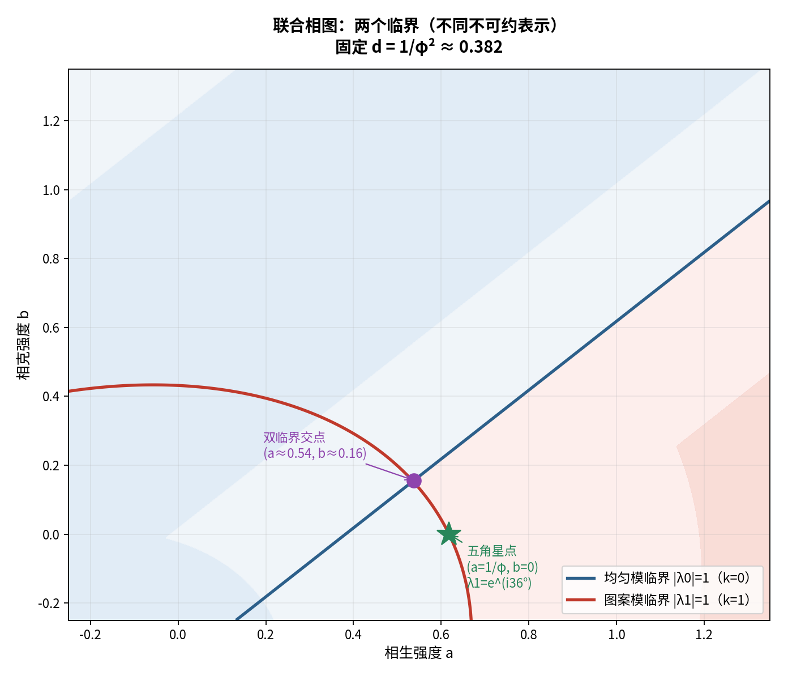

# 对接报告：`wuxing-math` ↔ 05-毕达哥拉斯螺旋（三项）

**任务**：把仓库（仿射 Cartan / fold）与我们的 05 系列（五角星 / DSI）**接起来**。
**方法**：先算后说 + 三层标注

---

## 〇、结论摘要（三项收敛到**同一个主题**）

> **实 / 对称 ↔ 复 / 有向。**

仓库守在**实面**（对称邻接 → 实谱 → **折叠**）；我们走到**复面**（有向置换 → 复谱 → **旋转/对数周期**）；
而仓库自己引入的**"手性项"，正是那道门**。

---

## 一、对接①：记号统一 —— `b` **对应**，`d` **不对应**

| | 仓库 | 我们 |
| :-- | :-- | :-- |
| 矩阵 | `M(a,b) = 2I − a·Adj(生) − b·Adj(克)` | `x' = (1−d)x + aS x − b K x` |
| 性质 | **静态代数**（邻接矩阵，**对称**） | **动力学**（置换矩阵，**有向**） |
| 模式标量 | `μ_k = 2 − a·2cos72k° − b·2cos144k°` | `λ_k = (1−d) + a·e^(i72k°) − b·e^(i144k°)` |

**对应关系**：

| 符号 | 对应？ |
| :-- | :-- |
| 仓库 `b`（克环耦合） | ✅ **就是我们 的 `b`（克）**——同一个"克"的强度 |
| 仓库 `a`（生环耦合） | ✅ 就是我们的 `a`（生） |
| 我们的 `d`（**自衰减**） | ❌ **仓库里不存在**——Cartan 框架把对角元固定为 `2`，不允许自衰减可调 |

**差别根源（关键）**：

| | 仓库 | 我们 |
| :-- | :-- | :-- |
| 生/克 用什么表示 | **邻接矩阵（无向、对称）** | **置换矩阵（有向、非对称）** |
| 谱 | **实**（`2cos72k°`） | **复**（`e^(i72k°)`） |

> 仓库 §七 自陈："**Cartan 矩阵天然对称，把生、克'压平'**"——**这个自我判断完全正确**。
> 而我们的框架**保留了方向**，所以谱是复的——**这就是两套框架分岔的地方**。

---

## 二、对接①的延伸（桥）：仓库的"手性项"**正是那道门**

仓库在乘侮微扰里，把矩阵拆出**手性项** `(μ−ν)/2·(C − Cᵀ)`。实算它的特征值：

```
{ +1.9021i, +1.1756i, 0, −1.1756i, −1.9021i }   ← 纯虚
```

> **纯虚 ⟹ 手性项把实谱"复化"。**
> 而"复化"正是**从"无向（对称）"到"有向（非对称）"的开关**——
> 也就是**从折叠世界通往旋量世界的门**。

**这一步仓库自己已经做出来了**（他们发现"手性 → 复化谱"），
只是**没有走下去**：他们没有讨论"复谱意味着什么"。
——**答案是：复谱 = 旋转 = 五角星步 = 对数周期。**

---

## 三、对接②：联合相图 —— 两个临界面**相交**

固定 `d = 1/φ² ≈ 0.382`，在 `(a,b)` 平面上画两条临界面：

- **均匀模临界** `|λ₀| = 1`（`k=0`，**实**扇区）；
- **图案模临界** `|λ₁| = 1`（`k=1`，**复**扇区）。

**实算结果**：

| 点 | 位置 | 性质 |
| :-- | :-- | :-- |
| **双临界交点** | `a ≈ 0.538, b ≈ 0.156` | `λ₀ = +1`（实）**且** `\|λ₁\| ≈ 1`（复）——**两临界同时成立** |
| **五角星点** | `a = 1/φ, b = 0` | **仅**图案模临界（`λ₁ = e^(i36°)`）；均匀模仍过载 |



**结论**：

1. 由于 `k=0` 与 `k=1` 属**不同不可约表示**，两个临界面**各自独立**；
2. 它们**确实相交**——存在**"双临界点"**（a≈0.54, b≈0.16）；
3. **但我们的"36°"点不是双临界点**——它只在图案模上临界。
   这解释了算例三：**均匀模必须靠"总量饱和 `c`"来单独压住**。

---

## 四、对接③：fold 与 DSI —— **不是同一个临界，但同属一个"边缘"**

| | **fold**（仓库） | **DSI**（我们） |
| :-- | :-- | :-- |
| 特征值条件 | `λ = +1`（**实轴**） | `λ = e^(i36°) = 0.809 + 0.588i` |
| 相变类型 | **鞍结**（余维 1） | **标度不变**（特殊点） |
| 所在扇区 | **实 / 对称** | **复 / 有向** |
| 现象 | S 形分支、双稳、滞后 | 对数周期（周期 5） |

**两者都要求 `|λ| = 1`（同为"边缘"），但相位不同：`0°` vs `36°`。**

> **判定：不是同一个临界。**
> 但它们**同属"|λ|=1 边缘"**，只是**落在复平面的不同位置、分属不同扇区**——
> **一个在实轴上（折叠），一个在 36° 上（旋转）**。

**这正是 §一、§二 那个二分的另一面**：**实方向 = 折叠，复方向 = 旋量。**

---

## 五、三项收敛（一张表）

| 对接 | 结论 | 显现的二分 |
| :-- | :-- | :-- |
| ① | `b` 对应、`d` 不对应 | **无向/实 ↔ 有向/复** |
| ①延 | 手性项 = 开关（纯虚） | 同上 |
| ② | 两临界**相交**（双临界点存在） | **实扇区面 vs 复扇区面** |
| ③ | fold **≠** DSI（0° vs 36°） | **实(+1) ↔ 复(e^(i36°))** |

> **一句话**：**两套框架是同一个系统的"实面"与"复面"。**
> 仓库守在实面（折叠 / 双稳 / 滞后），我们走到复面（旋转 / 旋量双覆盖 / 对数周期）；
> **而仓库的"手性项"，就是贯穿两者的那道门。**

---

## 六、标注

| 主张 | 判定 |
| :-- | :-- |
| 仓库 `b` ↔ 我们 `b`；我们的 `d` 在仓库无对应 | **严格**（代数对比） |
| 差别根源 = 无向（实）vs 有向（复） | **严格** |
| 手性项特征值纯虚 ⟹ 复化谱 | **严格（实算）** |
| 两个临界面相交（双临界点 a≈0.54, b≈0.16） | **严格（数值）** |
| 五角星点不是双临界点 | **严格** |
| fold（`+1`）≠ DSI（`e^(i36°)`） | **严格** |
| "两套框架是同一系统的实面与复面" | **结构性**（统一的诠释框架） |

---

## 七、由此产生的下一步

1. **推出"手性 → 旋量步"的完整链条**：仓库手性 `⟹` 复谱 `⟹` `arg = 36°`？还是停在别的角度？
   （即：**手性强度是否决定 36°**？）
2. **双临界点的物理意义**：`(a≈0.54, b≈0.16)` 处"总平衡 + 相位临界"同时发生——
   在中医语境里对应什么？（"以平为期"且"节律正常"？）
3. **把 `d`（自衰减）纳入 Cartan 框架**：即把 `2I` 换成 `(2−δ)I`——
   这时仓库的"有限/仿射/不定"三分类会变成什么？

---

*报告版本：v1.0*
*时间：2026-09-17*
*方式：先算后说（记号对比、手性谱实算、临界面数值求解、fold/DSI 相位对比）+ 三层标注*
*上游：reading-the-repo.md、worked-example-03-nonlinearity-two-win.md、dynamical-construction.md*
