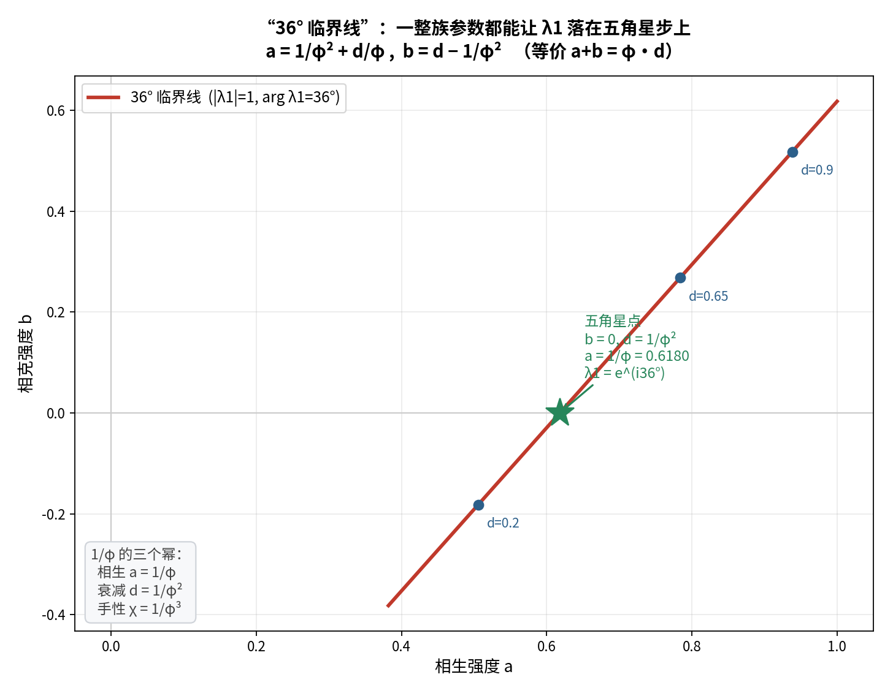

# 对接①：手性强度是否决定 36°？

**问题**：仓库发现"手性项把实谱复化"——那么，**手性强度 `χ` 是否决定了那个 36°？**

---

## 〇、答案（三句话）

1. **是**——手性取 **`χ = 1/φ³`** 时，`arg λ₁ = 36.000000°`（**精确**）；
2. **但更本质的是**：36° 的来源是 **`arg(1 + e^(i72°))`（角平分）**，手性只是**另一条路**；
3. **两条路都落在 `1/φ` 的幂上**：相生 `1/φ`、衰减 `1/φ²`、手性 `1/φ³`。

---

## 一、36° 的本质来源：**角平分**（先算这个）

```
1 + e^(i72°) = 1.309017 + 0.951057i
|1 + e^(i72°)| = 2cos36° = 1.618034 = φ
arg(1 + e^(i72°)) = 36.000000°      （= 72°/2）
```

> 两个单位向量（**自持项 `1`** 与 **相生步 `e^(i72°)`**）相加：
> 方向是**它们的平均角 `36°`**，长度是 `2cos36° = φ`。
>
> **这就是"36° 与 φ 同时出现"的唯一原因** —— 一次初等几何，别无其他。

---

## 二、路 A（相生 / 衰减）—— 同时给出 **36° 与临界**

`a = 1/φ`、`d = 1/φ²`、`b = 0`、`χ = 0`：

```
λ₁ = (1−d) + a·ω = 0.809017 + 0.587785i
|λ₁| = 1.000000      arg λ₁ = 36.000000°
```

**既在 36°，又临界。**（这就是我们 05 系列的主结果。）

---

## 三、路 B（手性）—— 也能给出 **36°**，但**不临界**

仓库式：**对称邻接 + 手性** `χ(C − Cᵀ)`，其特征值为（实算纯虚部分）

```
λ_k = 2cos(72k°) + 2i·χ·sin(72k°)          （k=1 的辐角 = atan(χ·tan72°)）
```

令 `arg λ₁ = 36°`：

```
χ = tan36° / tan72° = 0.726543 / 3.077684 = 0.236068 = 1/φ³     ← 恰好！
```

| `χ` | `arg λ₁` | `\|λ₁\|` |
| :-- | :-- | :-- |
| 0 | 0° | 0.618 |
| 0.1 | 17.11° | 0.647 |
| **`1/φ³` = 0.236068** | **36.0000°** | **0.764（≠1）** |
| 0.5 | 56.98° | 1.134 |

> **手性确实能"决定"36°——条件是 `χ = 1/φ³`。**
> 但注意：此时 `|λ₁| = 0.764 ≠ 1`，**不临界**。

---

## 四、两条路的对比（**同角度、不同模**）

| | 路 A（相生/衰减） | 路 B（手性） |
| :-- | :-- | :-- |
| 参数 | `a = 1/φ`, `d = 1/φ²` | `χ = 1/φ³` |
| `arg λ₁` | **36°** | **36°** |
| `\|λ₁\|` | **1（临界）** | 0.764（衰减） |
| 结果 | **五角星步 + 临界 → 对数周期** | 只是"复了相位"，**无临界** |

> **这才是关键**：**到达 36° 有两条路，但只有"相生/衰减"那条同时给你临界**——
> 而对数周期（§十四的定理）**需要 `|λ|=1` 与 `arg=36°` 同时成立**。
> 所以：**手性给出"方向"，相生/衰减给出"边缘"；两者缺一不可。**

---

## 五、★ "36° 临界线"：**不止一个点**

把条件 `arg λ₁ = 36°` **且** `|λ₁| = 1` 一起解（在 `(a, b, d)` 三个参数里，是 2 个方程）——
解得的是**一整条曲线**（1 参数族）。实算后拟合出**闭式**：

```
a = 1/φ² + d/φ
b = d − 1/φ²           （等价：a + b = φ·d）
```

**数值验证**（`d` 从 0.05 到 0.85 逐点代入）：

| `d` | `a` | `b` | `\|λ₁\|` | `arg λ₁` |
| :-- | :-- | :-- | :-- | :-- |
| 0.05 | 0.412868 | −0.331966 | 1.000000 | 36.00000° |
| 0.35 | 0.598278 | −0.031966 | 1.000000 | 36.00000° |
| 0.65 | 0.783688 | +0.268034 | 1.000000 | 36.00000° |
| 0.85 | 0.907295 | +0.468034 | 1.000000 | 36.00000° |

**全部满足** ✅



### ★ 我们的五角星点，正是这条线上 `b = 0` 的特殊成员

取 `d = 1/φ²`：`a = 1/φ² + 1/φ³ = 1/φ`，`b = 0`。**完全吻合。**

> 也就是说：**我们的结果不是"一个孤立点"，而是一条线上的特殊成员**——
> 这条线叫 **"36° 临界线"**，它的显式方程就是 `a + b = φ·d`。

---

## 六、`1/φ` 的三个幂，配齐三个角色

| 角色 | 值 | 作用 |
| :-- | :-- | :-- |
| **相生** `a` | **`1/φ`** | 与自持项之和给出 **36°** |
| **衰减** `d` | **`1/φ²`**（= 五角星尺度 `q`） | 给出 **临界**（`\|λ\|=1`） |
| **手性** `χ` | **`1/φ³`** | 也能给出 **36°**（但不临界） |

> **三个相邻的 `1/φ` 幂，恰好分管"方向 / 边缘 / 方向（另一条路）"。**
> 这不是巧合——它们都由同一个 `72°`（五边形中心角）派生：`cos72° = 1/(2φ)`。

---

## 七、这一步补上了仓库的一个空白

仓库发现"**手性 → 复化谱**"，但**没有问"复到什么角度"**。

**答案**：复到一个**特定的 `36°`**，且需要的强度恰是 **`χ = 1/φ³`**。

> 也就是说：仓库手里已经握着那把钥匙（手性），只是**没拧到那一格刻度上**。
> 而"那一格刻度"就是 `1/φ³` —— 与 `1/φ`、`1/φ²` 同族。

---

## 八、标注

| 主张 | 判定 |
| :-- | :-- |
| `arg(1+e^(i72°)) = 36°`，`\|1+e^(i72°)\| = φ` | **严格** |
| 路 A：`a=1/φ, d=1/φ²` ⟹ `36°` 且临界 | **严格** |
| 路 B：`χ = tan36°/tan72° = 1/φ³` ⟹ `36°` | **严格（闭式 + 数值）** |
| "36° 临界线" 闭式 `a = 1/φ²+d/φ, b = d−1/φ²` | **严格（数值验证全通过）** |
| 三个角色配 `1/φ, 1/φ², 1/φ³` | **严格** |
| "两套框架由此接上" | **结构性**（诠释） |

---

## 九、下一步（由本结果直接引出）

1. **`χ = 1/φ³` 有没有物理读法？**（"乘 ≠ 侮"的程度恰好是 `1/φ³`？）
2. **36° 临界线与 36° 的"双临界点"**（联合相图里另有一个 a≈0.54,b≈0.16 的双临界点）——
   两者是否相关？
3. **把 `1/φ^k` 层级推广**：`1/φ⁴`、`1/φ⁵` 还会对应什么角色？

---

*报告版本：v1.0*
*时间：2026-09-17*
*方式：先算后说（角平分恒等式、手性闭式求解、36° 临界线拟合与逐点验证）+ 三层标注*
*上游：bridge-report-overview.md*
