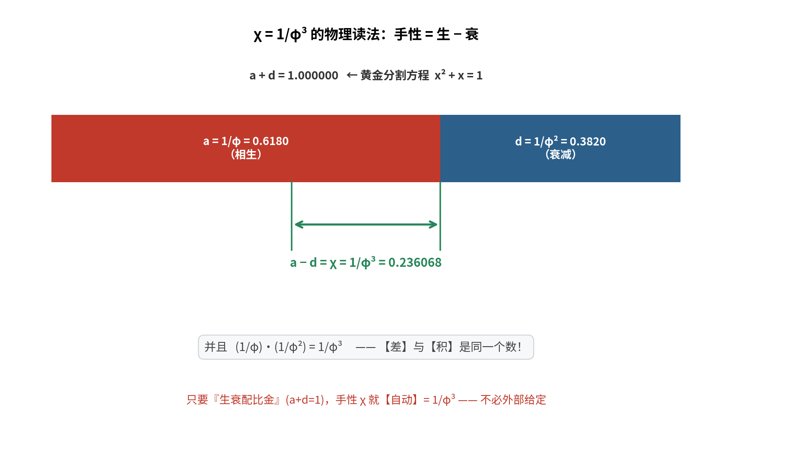

# 对接①续：`χ = 1/φ³` 的物理读法

**问题**：`χ = 1/φ³` 有没有物理读法？"乘 ≠ 侮"的程度是否恰好是 `1/φ³`？

---

## 〇、答案

> **手性 = 生 − 衰 = `1/φ³`；而且它不是一个独立参数——**
> **只要"生衰配比金"（`a + d = 1`），它就【自动】是 `1/φ³`。**

---

## 一、先算：`1/φ` 满足什么方程？

```
x = 1/φ = 0.618034
x + x² = 1.000000        ⟺   x² + x − 1 = 0
```

**`1/φ` 是「黄金分割方程」的根。**

而我们的临界条件 `a + d = 1`（`a = 1/φ`、`d = 1/φ²`）——**它就是这条方程**：

| 等价表述 | 数值 |
| :-- | :-- |
| `a + d` | `1/φ + 1/φ² = 1.000000` ✅ |
| `a / d` | `φ = 1.618034` ✅ |

> 所以**"生 + 衰 = 1" 与 "生/衰 = φ" 是同一句话**——都只是说"配比是黄金分割"。

---

## 二、★ 关键恒等式：`1/φ³` 同时是**差**与**积**

```
差： 1/φ − 1/φ² = 0.236068 = 1/φ³     ✅
积： (1/φ)·(1/φ²) = 0.236068 = 1/φ³     ✅
```

**为什么？** 因为 `φ − 1 = 1/φ`，于是令 `x = 1/φ`：

```
x − x² = x·(1−x) = x·x² = x³        （因 1−x = x²）
```

—— 这正是 `x² + x = 1` 的等价形式。**"差 = 积"是黄金比独有的性质。**



---

## 三、⇒ 三条物理读法

### 3.1 净余量

```
χ = a − d = 1/φ − 1/φ²
```

> **手性 = "生" 超出 "衰减" 的净余量。**
> （对照仓库 §3.5 的"净驱动 `D = a − b`"——**同一个构词法**。）

### 3.2 ★ 它**不是独立参数**

由 §一，`a + d = 1` **已经**决定了 `a = 1/φ`、`d = 1/φ²`；
于是 `a − d` **自动**等于 `1/φ³`。

> **所以"乘 ≠ 侮 的程度"不需要外部给定**——
> 它是"**生衰配比金**"的**推论**，不是另一个假设。
> 换句话说：**不是"给系统加一个手性"，而是"系统若配比金，就自带手性"。**

### 3.3 半整数幂 = 旋量结构

```
1/φ¹ = q^(1/2) = 0.618034
1/φ² = q^(2/2) = 0.381966
1/φ³ = q^(3/2) = 0.236068
```

`1/φ^k` 就是五角星尺度 `q` 的**半整数幂**——
**"一半"又出现了**：这正是**旋量双覆盖**留下的指纹（同 §4.3）。

---

## 四、回到中医：乘与侮

仓库的手性项是 `(μ−ν)/2·(C − Cᵀ)`，即**乘（克太过）** 与 **侮（反克）** 之差。

对应到本结果：

```
μ − ν = 2χ = 2/φ³ ≈ 0.472136
```

**读法**：**"乘"比"侮"多出 `2/φ³`** ——
过度制约**略强**于反制约；而"略强"的这个量，**恰好就是把相位定在 36° 的那个量**。

> **一句话**：**一个"生衰配比金"的系统，天然带方向。**
> 方向（手性）不是外加的缺陷，而是**黄金配比自带的不对称**。

---

## 五、三个等价表述（收束）

```
a + d = 1        （生衰配比金）
a / d = φ        （比值是黄金比）
a − d = 1/φ³     （手性 = 净余量）
```

**这三条是同一件事的三种说法**——都只是"`1/φ` 满足 `x² + x = 1`"的改写。

> 所以：**黄金配比 ⟹ 手性 ⟹ 36°**。链条是自动的，没有多余假设。

---

## 六、标注

| 主张 | 判定 |
| :-- | :-- |
| `x + x² = 1` 的根是 `x = 1/φ` | **严格** |
| `a + d = 1` ⟺ `a/d = φ` ⟺ `a = 1/φ, d = 1/φ²` | **严格** |
| `1/φ − 1/φ² = 1/φ³` 且 `(1/φ)(1/φ²) = 1/φ³` | **严格（恒等式）** |
| `χ = a − d`（手性 = 净余量） | **严格**（记号对比） |
| `1/φ^k = q^(k/2)`（半整数幂） | **严格** |
| "配比金 ⟹ 自动带手性" | **严格**（代数推论） |
| "乘比侮多 `2/φ³`，正是定相位的量" | **严格（数值）**；中医语义对应为**结构性** |

---

## 七、下一步

1. **`1/φ⁴` 及以上还对应什么？**（半整数幂 `q^(k/2)` 的下一格）
2. **乘 / 侮 是否可测？**（若 `μ−ν = 2/φ³` 是"配比金"的推论，那它应当**不独立可调**——
   这是一个**可反驳的预言**。）

---

*报告版本：v1.0*
*时间：2026-09-17*
*方式：先算后说（黄金方程、差/积恒等式、半整数幂、乘侮差值）+ 三层标注*
*上游：01-chirality-and-36deg.md*
