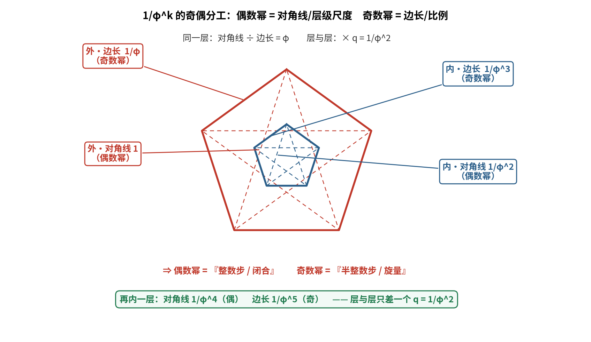

# 对接①续二：`1/φ^k` 的幂格与奇偶分工

**问题**：`1/φ⁴`、`1/φ⁵` 还对应什么角色？

---

## 〇、答案

> **`1/φ^k = q^(k/2)` 构成一条幂格。**
> **偶数 k = 整数步（闭合）；奇数 k = 半整数步（旋量）。**
>
> - **`1/φ⁴`**：几何上 = 第二层五边形的**对角线**；动力学上 = **一个五行步（72°）的模**，
>   即**相生步 `R¹` 的尺度**。
> - **`1/φ⁵`**：几何上 = 第二层五边形的**边长**；= **生 × 衰²**；半整数（旋量）。

---

## 一、奇偶分工（严格）

```
k=1: 1/φ   = 0.618034 = q^(1/2)   半整数步（旋量）
k=2: 1/φ²  = 0.381966 = q^(2/2)   整数步（闭合）
k=3: 1/φ³  = 0.236068 = q^(3/2)   半整数步（旋量）
k=4: 1/φ⁴  = 0.145898 = q^(4/2)   整数步（闭合）
k=5: 1/φ⁵  = 0.090170 = q^(5/2)   半整数步（旋量）
k=6: 1/φ⁶  = 0.055728 = q^(6/2)   整数步（闭合）
```

**规律**：`1/φ^k = q^(k/2)`。**k 偶 ⟹ 整数幂的 q（闭合）；k 奇 ⟹ 半整数幂的 q（旋量）。**

---

## 二、几何来源（严格）

嵌套五边形里，每一层同时给出两个数：

| 层 | 对角线（偶数幂） | 边长（奇数幂） |
| :-- | :-- | :-- |
| 外层 | `1` | `1/φ` |
| 星内层 | `1/φ²` | `1/φ³` |
| 再内层 | `1/φ⁴` | `1/φ⁵` |

- **同一层**：对角线 ÷ 边长 = `φ`；
- **层与层**：× `q = 1/φ²`。

> **★ 偶数幂 = 对角线（层级尺度）；奇数幂 = 边长（比例）。**
> 而对接①已经告诉我们：**相生 = `1/φ`（边），手性 = `1/φ³`（边）**——
> 两者**都是"边长"**，**完全一致**。



---

## 三、半级生成元（严格）

取临界本征步的主平方根：

```
Φ = (1/φ)·e^(i18°)          |Φ| = 0.618034 = 1/φ,  arg = 18.000000°
Φ² = q·e^(i36°)              ← 正是我们的临界本征步 λ₁  ✅
```

**所以 `1/φ` 配 18°、`1/φ²` 配 36°**——半级与一级。

---

## 四、相位格（严格）

| k | 模 `1/φ^k` | 相位 `18k°` | = 几个本征步（36°） |
| :-- | :-- | :-- | :-- |
| 1 | 0.6180 | 18° | 0.5 |
| 2 | 0.3820 | 36° | 1.0 |
| 3 | 0.2361 | 54° | 1.5 |
| 4 | 0.1459 | **72°** | 2.0 |
| 5 | 0.0902 | 90° | 2.5 |
| 6 | 0.0557 | 108° | 3.0 |

> `k=4` 配 **72°**——那正是**五行的一步旋转**（`C₅` 的 72°）。

---

## 五、复合律（严格）

```
1/φ^m · 1/φ^n = 1/φ^(m+n)
```

**角色可叠加，指数即"步数"**：

```
1/φ³ = (1/φ)·(1/φ²)   ← 生 × 衰 = 手性                  （对接①）
1/φ⁴ = (1/φ²)²        ← 衰² = 两步                      （本报告）
1/φ⁵ = (1/φ)·(1/φ⁴) = (1/φ²)·(1/φ³)  ← 生 × 衰² = 衰 × 手性
```

---

## 六、动力学对应（严格）

本征步 `T = q·e^(i36°)`（**36° 是"半级"**），于是：

| 步数 | 对象 | 模 | 相位 | 五行语义 |
| :-- | :-- | :-- | :-- | :-- |
| 1 | `T` | **`1/φ²`** | 36° | **五角星步**（半级） |
| 2 | `T²` | **`1/φ⁴`** | 72° | **相生 `R¹`**（五行一步） |
| 4 | `T⁴` | `1/φ⁸` | 144° | **相克 `R²`** |
| 6 | `T⁶` | `1/φ¹²` | 216° | **相侮 `R³`** |
| 8 | `T⁸` | `1/φ¹⁶` | 288° | **子病及母 `R⁴`** |
| 10 | `T¹⁰` | `1/φ²⁰` | 360° | 相位复原（旋量已翻） |

**一般式（严格）**：

```
五行第 n 步关系  R^n = T^(2n)     模 = 1/φ^(4n)     相位 = 72n°
```

> **★ 所以 `1/φ⁴` 正是"相生步"的尺度**——五行图上走一步，振幅就乘 `1/φ⁴`。

**两个"模"要分清**（本报告修正了初稿的一处混淆）：

| 量 | 模 | 含义 |
| :-- | :-- | :-- |
| 本征**半**步 `T` | `1/φ²`（= `d`，衰减） | 转 36°（五角星） |
| 五行**一**步 `T²` | `1/φ⁴` | 转 72°（相生） |

---

## 七、一句话

> **奇偶分工不是人为规定，而是"旋量 vs 张量"在黄金尺度上的显形：**
> **能配成整数步的（偶）闭合；配不成整数的（奇）要转两圈。**
> 而 **`1/φ⁴` 与 `1/φ⁵` 就是第二层的"对角线"与"边长"**——
> 一个给出五行步的尺度，一个给出该层的比例。

---

## 八、标注

| 主张 | 判定 |
| :-- | :-- |
| `1/φ^k = q^(k/2)` | **严格** |
| 偶数幂 = 嵌套五边形对角线；奇数幂 = 边长 | **严格（几何）** |
| `Φ = (1/φ)e^(i18°)` 是 `λ₁` 的主平方根，`Φ² = q·e^(i36°)` | **严格** |
| 相位格 `1/φ^k ↔ 18k°` | **严格（给定生成元 Φ）** |
| 复合律 `1/φ^m·1/φ^n = 1/φ^(m+n)` | **严格** |
| `R^n = T^(2n)`，模 `1/φ^(4n)`、相位 `72n°` | **严格（数值核对）** |
| 奇数幂 = 旋量（需双圈复原） | **严格（`T⁵` 相位 180°、`T¹⁰` 360°）** |
| `1/φ^k` 配 `18k°` 的"自然性" | **结构性** |

---

## 九、下一步

1. 五行的 `R^n` 尺度 `1/φ^(4n)` 衰减极快（`1/φ⁸ ≈ 0.021`）——
   这是否就是"**克/侮/子病及母都是深层微扰**"的定量依据？
2. **`1/φ⁵`（第二层边长）能否找到中医对应**？（第二层的"生/手性"）

---

*报告版本：v1.0*
*时间：2026-09-17*
*方式：先算后说（幂格、奇偶分工、半级生成元、相位格、复合律、`R^n` 核对）+ 三层标注*
*上游：01a-physical-reading-of-chi.md*
*说明：初稿曾把 `R^n` 的模误写为 `1/φ^(2n)`，核对后修正为 `1/φ^(4n)`。*
