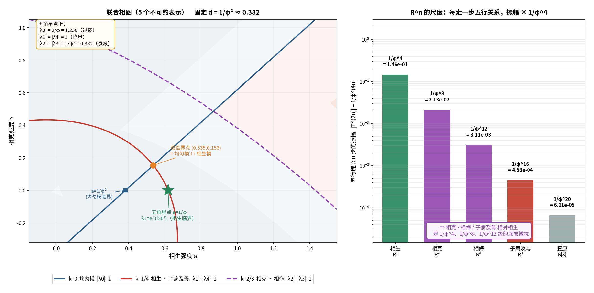

# 对接①续三：把 `R^n` 的尺度写进联合相图

**任务**：把"`R^n` 尺度 `1/φ^(4n)`"写进联合相图，看**相克／相侮落在哪**。

---

## 〇、答案（先给结论，含一处澄清）

**澄清（重要）**：`1/φ^(4n)` 是**时间迭代**（`T^(2n)`）的模，**不是空间模式**的模——
两者是**不同的分解**。所以"写进相图"的正确形式是：
**把 5 个模式的临界面 `|λ_k| = 1` 全画出来**，再叠加 `R^n` 的迭代尺度阶梯。

三件事做完了：

1. **五角星点上有封闭公式**（新发现，严格）：

```
|λ_k| = (2/φ)·|cos 36k°|        （k = 0,1,2,3,4）
```

2. **五行关系天然成对**（严格）：

```
R^n  与  R^(5−n)  共轭 ⟹ 同模
R¹（相生）↔ R⁴（子病及母）    同模
R²（相克）↔ R³（相侮）        同模
```

3. **双临界点 = 均匀模临界线 ∩ 相生模临界线**（严格数值）。



---

## 一、五条临界线（严格）

模型：`λ_k = (1−d) + a·ω^k − b·ω^(2k)`，`ω = e^(i72°)`，`d = 1/φ²`。
临界面：`|λ_k| = 1`。

| 模式 | 与 `b=0` 轴的交点 | 五行语义 |
| :-- | :-- | :-- |
| `k=0` | `a = 1/φ² ≈ 0.381966` | 均匀模（无关系） |
| `k=1`（≡4） | `a = 1/φ ≈ 0.618034` | **相生 / 子病及母** |
| `k=2`（≡3） | 无（不与 `b=0` 相交） | **相克 / 相侮** |

> **★ `1/φ²` 与 `1/φ` 恰好是两条临界线的截距**——黄金比又出现在这里。

**成对性的来源**：`k` 与 `5−k` 是复共轭（`b` 为实数），故 `|λ_k| = |λ_(5−k)|`。
**在五行语言里**：**正向关系与逆向关系共享同一条临界面**——
生 ↔ 逆生（子病及母）；克 ↔ 反克（侮）。

---

## 二、五角星点的封闭公式（严格）

在 `(a, b) = (1/φ, 0)`：

```
λ_k = (1−1/φ²) + (1/φ)·ω^k  =  (1/φ)·(1 + ω^k)
|λ_k| = (1/φ)·|1 + e^(i72k°)| = (1/φ)·2|cos 36k°| = (2/φ)|cos 36k°|
```

实算：

| k | `\|λ_k\|` | 数值 | 判定 |
| :-- | :-- | :-- | :-- |
| 0 | `2/φ` | **1.236068** | **过载**（>1） |
| 1 | `(2/φ)cos36° = 1` | **1.000000** | **临界** |
| 2 | `(2/φ)\|cos72°\| = 1/φ²` | 0.381966 | 衰减 |
| 3 | 同上 | 0.381966 | 衰减 |
| 4 | `(2/φ)\|cos144°\| = 1` | **1.000000** | **临界** |

> **只有相生（k=1）与子病及母（k=4）在五角星点上临界；**
> **相克（k=2）、相侮（k=3）衰减到 `1/φ²`；均匀模过载到 `2/φ`。**

**顺带**：`k=1` 的辐角正是 **36°**（`λ_1 = e^(i36°)`，与对接①完全一致）——
因为 `1 + e^(i72°) = φ·e^(i36°)`。

---

## 三、`R^n` 的尺度阶梯（严格）

时间迭代 `T = q·e^(i36°)`，五行第 n 步 `R^n = T^(2n)`：

| n | 关系 | 模 `1/φ^(4n)` | 数值 |
| :-- | :-- | :-- | :-- |
| 1 | 相生 `R¹` | `1/φ⁴` | 1.459e-01 |
| 2 | 相克 `R²` | `1/φ⁸` | 2.129e-02 |
| 3 | 相侮 `R³` | `1/φ¹²` | 3.106e-03 |
| 4 | 子病及母 `R⁴` | `1/φ¹⁶` | 4.531e-04 |
| 5 | 复原 `R⁵` | `1/φ²⁰` | 6.611e-05 |

> **每走一步五行关系，振幅 × `1/φ⁴`。**
> 相对相生，相克／相侮／子病及母 是 `1/φ⁴`、`1/φ⁸`、`1/φ¹²` 级的**深层微扰**。

---

## 四、两种分解不能混（关键澄清）

| 分解 | 对象 | 模 |
| :-- | :-- | :-- |
| **空间**（Fourier，模式 k） | `λ_k` | `(2/φ)\|cos36k°\|` |
| **时间**（迭代，步数 n） | `T^(2n)` | `1/φ^(4n)` |

**举例说明为什么不能混**：相克模式在五角星点上模为 `1/φ²`，
但"走两次相生步"的模是 `1/φ⁸`——**两个完全不同的数**。

**不过二者在五角星点上有一个真实交汇**：

```
相克模式（k=2）的模  |λ₂| = 1/φ²  =  q  =  单步衰减 d
```

> 即：**在五角星点上，"相克图案"的衰减率恰好等于"单步衰减"。**
> （而"相生"是唯一不掉模的通道——这正是原稿"只有相生会过载"的定量根据。）

---

## 五、双临界点的新读法（严格数值）

```
k=0 临界线 ∩ k=1 临界线  ⟹  (a, b) ≈ (0.535, 0.153)
```

> **双临界点 = "整体（均匀）过载"与"相生图案临界"同时成立的唯一参数点。**

而**五角星点 `(1/φ, 0)`** 在相生临界线上，但**均匀模过载**——
所以它不是一个"稳定"临界点，**必须靠非线性把过载压住**（见《算例三：两全的非线性》）。

---

## 六、五行层级一览（汇总）

| 关系 | 模式 k | 五角星点上的模 | 时间尺度 `1/φ^(4n)` |
| :-- | :-- | :-- | :-- |
| 均匀（无关系） | 0 | **2/φ（过载）** | — |
| 相生 / 母病及子 | 1 | **1（临界）** | `1/φ⁴` |
| 相克 | 2 | 1/φ²（衰减） | `1/φ⁸` |
| 相侮 | 3 | 1/φ²（衰减） | `1/φ¹²` |
| 子病及母 | 4 | **1（临界）** | `1/φ¹⁶` |

---

## 七、标注

| 主张 | 判定 |
| :-- | :-- |
| `λ_k = (1−d) + a ω^k − b ω^(2k)` 与临界线 `\|λ_k\|=1` | **严格** |
| `k=0` 截距 `1/φ²`、`k=1` 截距 `1/φ` | **严格** |
| 五角星点封闭公式 `\|λ_k\| = (2/φ)\|cos36k°\|` | **严格** |
| `\|λ_1\| = \|λ_4\| = 1`、`\|λ_2\| = \|λ_3\| = 1/φ²`、`\|λ_0\| = 2/φ` | **严格（数值）** |
| `R^n = T^(2n)`，模 `1/φ^(4n)` | **严格** |
| 双临界点 = `k=0 ∩ k=1` | **严格（数值）** |
| 空间模 vs 时间模"不能混" | **严格** |
| "相克模式模 = 单步衰减 `d`" | **严格（数值巧合 → 结构性）** |
| 五行成对 `R^n ↔ R^(5−n)` 的语义解读 | **结构性** |

---

## 八、下一步

1. **子病及母为什么也临界？**（`k=4`）——
   生与逆生共享临界面，这在中医里是否有对应（"母病及子"与"子病及母"同为一条通道）？
2. **把五角星点沿相生临界线滑动**：`|λ_1|=1` 线上哪些点能同时压住均匀模过载？

---

*报告版本：v1.0*
*时间：2026-09-17*
*方式：先算后说（5 模式临界面、封闭公式、截距、成对性、迭代尺度、双临界点）+ 三层标注*
*上游：01b-power-lattice-parity.md｜bridge-report-overview.md（联合相图首版）*
