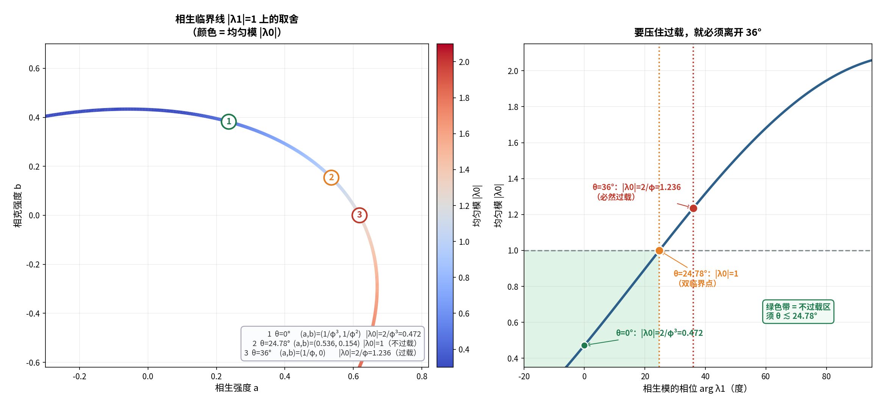

# 对接①续四：沿相生临界线滑动——"压住过载"与"保住 36°"的取舍

**任务**：在 `|λ_1| = 1`（相生临界线）上滑动，看**哪些点能同时压住均匀模过载**。

---

## 〇、答案

> **线性框架下，"压住过载"与"保住 36°"不可兼得。**
>
> - **θ = 36°**（五角星点）⟹ `|λ_0| = 2/φ = 1.236`，**必然过载**；
> - 要让 `|λ_0| ≤ 1`，相位必须降到 **θ ≲ 24.78°**（双临界点）；
> - 所以**必须引入非线性**（总量饱和）——它能在**不改相位**的前提下只压均匀模。



---

## 一、把临界线参数化（严格）

令 `λ_1 = e^(iθ)`，则

```
a·ω − b·ω² = e^(iθ) − 1/φ
```

这是 `(a,b)` 的 **2×2 实线性系统**（矩阵条件数 1.376），对任意 θ 有唯一实解 `(a, b)`。

**校验**：`θ = 36°` ⟹ `(a,b) = (1/φ, 0.000)`，`|λ_0| = 2/φ` ✅（正是五角星点）。

---

## 二、滑动的结果（严格）

| θ | `a` | `b` | `\|λ_0\|` | 状态 |
| :-- | :-- | :-- | :-- | :-- |
| 0° | 0.23607 | 0.38197 | 0.472136 | 安全 |
| 10° | 0.37439 | 0.31035 | 0.682075 | 安全 |
| 20° | 0.48974 | 0.21053 | 0.897240 | 安全 |
| **24.779°** | **0.53569** | **0.15372** | **1.000000** | **临界（= 双临界点）** |
| 30° | 0.57859 | 0.08553 | 1.111095 | 过载 |
| **36°** | **0.61803** | **0.00000** | **1.236068** | **过载（五角星点）** |
| 45° | 0.65655 | −0.14068 | 1.415265 | 过载 |
| 60° | 0.66374 | −0.39942 | 1.681193 | 过载 |
| 90° | 0.46868 | −0.94295 | 2.029672 | 过载 |

> **单调性**：θ 增大 ⟹ `b` 减小 ⟹ `|λ_0|` 增大。
> **分界**：`θ = 24.779°`（`|λ_0| = 1`）——就是**双临界点**。

---

## 三、三个特殊点（严格）

| # | θ | `(a, b)` | `\|λ_0\|` | 身份 |
| :-- | :-- | :-- | :-- | :-- |
| 1 | `0°` | `(1/φ³, 1/φ²)` | `2/φ³ = 0.472136` | **纯实本征值**（相位归零） |
| 2 | `24.779°` | `(0.5357, 0.1537)` | `1` | **双临界点** |
| 3 | `36°` | `(1/φ, 0)` | `2/φ = 1.236068` | **五角星点** |

**★ 第 1 点值得单说**：θ=0 时参数**恰好又是黄金幂**——

```
a = 1/φ³（手性系数！）      b = 1/φ²（衰减/五角星尺度！）
```

**"相生模相位归零"这件事，恰好发生在"手性 = 1/φ³、衰减 = 1/φ²"的参数点上**。
（与01a-physical-reading-of-chi 完全呼应。）

---

## 四、封闭公式（严格）

把 `(a,b)` 代入，`λ_0` 是 `(cosθ, sinθ)` 的仿射函数：

```
λ_0(θ) = 1/φ + 1/φ³  −  (1/φ²)·cosθ  +  (2 sin36°)·sinθ
```

三条恒等式（已数值核对）：

```
1/φ + 1/φ³ = √5 / φ²  = 0.854102          （常数项）
4 sin²36°  = 3 − φ      = 1.381966         （斜率平方）
(1/φ²)² + (2 sin36°)² = (2/φ)² = 1.527864  （振幅平方）
```

于是 `λ_0` 的**振幅恰为 `2/φ`**，取值范围：

```
λ_0 ∈ [ √5/φ² − 2/φ ,  √5/φ² + 2/φ ] = [ −1/φ² , 2.090170 ]
```

> **`λ_0` 的极小值正好是 `−1/φ²`**——负的衰减系数。即：**沿相生临界线走到某处，均匀模可以被完全"反相抵消"**。

在 `θ = 36°` 处：`d|λ_0|/dθ = 2 sin36° = 1.175571`（每弧度）——
**离开 36° 越远，过载压得越快。**

---

## 五、结论：线性框架下不可两全

| 目标 | 需要 | 代价 |
| :-- | :-- | :-- |
| 保住 36° | `θ = 36°` | `\|λ_0\| = 2/φ > 1`（过载） |
| 不过载 | `θ ≲ 24.78°` | 相位偏离 36°（丢掉五角星几何） |

> **这正是《算例三：两全的非线性》的存在理由**：
> 线性叠加做不到，**必须让非线性只作用在均匀模（`k=0`）上**——
> 因为 `k=0` 与 `k=1` 属**不同不可约表示**，非线性项 `−c·X̄` 动 `k=0` 而 `λ_1` 分毫不动。

---

## 六、标注

| 主张 | 判定 |
| :-- | :-- |
| `\|λ_1\|=1` 可参数化为 `aω−bω² = e^(iθ) − 1/φ`，解唯一 | **严格** |
| `θ=36°` ⟹ `(1/φ, 0)`、`\|λ_0\| = 2/φ` | **严格** |
| `θ=24.779°` ⟹ `\|λ_0\| = 1`（= 双临界点） | **严格（数值）** |
| `θ=0°` ⟹ `(a,b) = (1/φ³, 1/φ²)` | **严格（数值）** |
| `λ_0(θ)` 的仿射封闭式与三条恒等式 | **严格** |
| `λ_0` 振幅 `= 2/φ`、下界 `= −1/φ²` | **严格** |
| `θ=36°` 处斜率 `= 2sin36°` | **严格** |
| "线性不可两全 ⟹ 必须非线性" | **严格（推理）** |

---

## 七、下一步

1. **把非线性加回来重画**：`|λ_1|=1` 线上，总量饱和 `−c·X̄` 能把 `|λ_0|` 压到多少而不动 `λ_1`？
2. **θ=0° 点 `(1/φ³, 1/φ²)` 的物理意义**：为什么"相位归零"要配"手性 = 衰减"的比值？

---

*报告版本：v1.0*
*时间：2026-09-17*
*方式：先算后说（参数化、扫线、三特殊点、封闭公式、恒等式核对）+ 三层标注*
*上游：01c-rn-scales-in-phase-diagram.md｜worked-example-03-nonlinearity-two-win.md*
*说明：首算曾因 `w**2 .real` 的运算符优先级把实解算成复解，已修正。*
