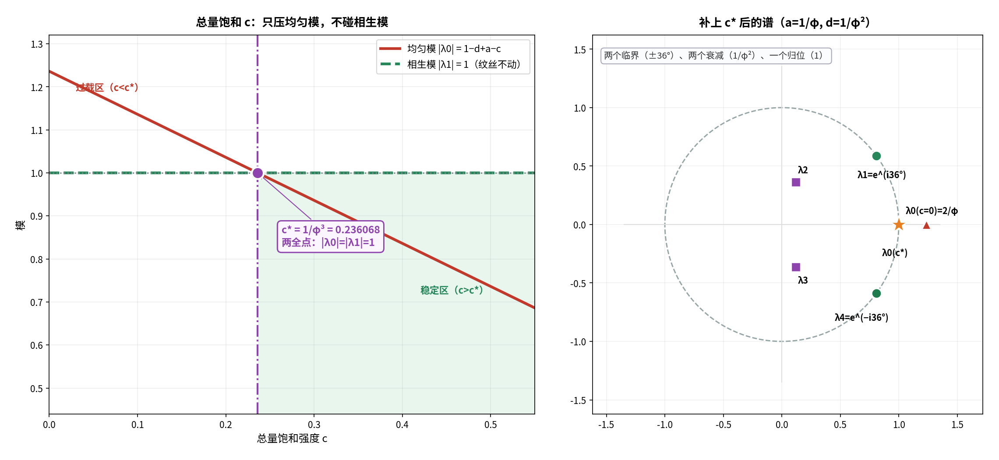

# 对接①续五：把总量饱和加回来——两全点 `c* = 1/φ³`

**任务**：总量饱和 `−c·X̄` 能把 `|λ_0|` 压到多少，而**不动** `λ_1`？

---

## 〇、答案

> **能压到恰好 1（且可继续压得更低），`λ_1` 分毫不动。**
>
> **两全点**：
> ```
> a = 1/φ（相生）    d = 1/φ²（衰减）    c = 1/φ³（总量饱和）
> ⟹  λ_0 = 1（均匀模临界）    λ_1 = e^(i36°)（原封不动）
> ```
>
> 而 **`c* = 2/φ − 1 = 1/φ − 1/φ² = 1/φ³ = 手性 χ`**——
> **四个身份，同一个数。**



---

## 一、为什么 `−c·X̄` 只动 `k=0`（严格）

`X̄ = (1/5)·Σx_i` 是 **`k=0` 投影**。

- 对 `k ≠ 0` 的模式：`Σx_i = 0` ⟹ `c·X̄ = 0` ⟹ `λ_k` **一点不动**；
- 矩阵形式：`−c·X̄·1 = −(c/5)·J·x`（`J` = 全 1 矩阵），这是**沿均匀方向的 rank-1 修正**。

于是特征值**精确分裂**：

```
λ_0 = 1 − d + a − c          （均匀模，被改）
λ_k = 1 − d + a·ω^k          （k ≠ 0，原样）
```

---

## 二、求 `c*`——得到一条一般定理（严格）

要求 `λ_0 = 1`：

```
1 − d + a − c = 1   ⟹   c = a − d
```

> **★ 一般定理：`c = a − d` ⟺ `λ_0 = 1`，与 `a`、`d` 的取值无关。**

实算（固定 `d = 1/φ²`，换四个 `a`）：

| `a` | `c = a − d` | `λ_0` |
| :-- | :-- | :-- |
| 0.4 | 0.018034 | **1.000000000000** |
| `1/φ` | 0.236068 | **1.000000000000** |
| 0.8 | 0.418034 | **1.000000000000** |
| 1.0 | 0.618034 | **1.000000000000** |

**再要 `λ_1 = e^(i36°)`**，就必须 `(a, d) = (1/φ, 1/φ²)`（五角星点）。合起来：

```
c* = a − d = 1/φ − 1/φ² = 1/φ³ = 0.2360679775
```

---

## 三、★ `c*` 的四重身份（严格）

```
2/φ − 1          = 0.2360679775
1/φ − 1/φ²       = 0.2360679775   （相生 − 衰减）
1/φ³             = 0.2360679775
手性 χ = tan36°/tan72° = 0.2360679775
```

> **"总量饱和强度" = "手性" = "相生 − 衰减" = `1/φ³`。**
> 与《01-chirality-and-36deg》《01a-physical-reading-of-chi》**完全闭环**。

---

## 四、补上 `c*` 后的谱（严格）

| 模式 | 补 `c*` 前 | 补 `c*` 后 | 位置 |
| :-- | :-- | :-- | :-- |
| `k=0` 均匀 | `2/φ = 1.236`（过载） | **`1`** | 单位圆上 |
| `k=1` 相生 | `e^(i36°)` | **`e^(i36°)`** | 单位圆上 |
| `k=4` 子病及母 | `e^(−i36°)` | **`e^(−i36°)`** | 单位圆上 |
| `k=2` 相克 | `(1/φ²)e^(i72°)` | 同 | 圆内 `1/φ²` |
| `k=3` 相侮 | `(1/φ²)e^(−i72°)` | 同 | 圆内 `1/φ²` |

**只有 `k=0` 动了一格，其余四模纹丝不动。**

---

## 五、一处诚实的澄清（重要）

`−c·X̄` 在 `x` 上其实是**线性的**（`X̄` 是线性泛函）——
它是 **rank-1 修正**，不是真非线性。

**所以"必须非线性"应更精确地说**：

> **必须引入一个"只作用于 `k=0` 的额外通道"。**
> `−c·X̄` 是最简实现（线性 rank-1，可调任意精度）。

**对照**：真非线性（如立方饱和 `−c|x|²x`）会把 `arg λ_1` 推到 **42.17°**——
因为它**混合不同不可约表示**。这正是"总量饱和"与"立方饱和"的分水岭。

---

## 六、三个黄金幂配齐（收束）

| 参数 | 值 | 角色 |
| :-- | :-- | :-- |
| `a` | `1/φ` | 相生强度 |
| `d` | `1/φ²` | 衰减系数 |
| `c` | `1/φ³` | 总量饱和（= 手性 = `a − d`） |

且 `a + d = 1`（黄金分割方程）、`c = a − d`。

> **整个模型的参数集由一个数 `φ` 完全决定。**

**最终方程**：

```
x_i(t+1) = (1 − d)x_i + a(Sx)_i − c·X̄ ,   a = 1/φ,  d = 1/φ²,  c = 1/φ³
```

---

## 七、标注

| 主张 | 判定 |
| :-- | :-- |
| `−c·X̄` 只改 `λ_0`，`k≠0` 不动 | **严格** |
| `λ_0 = 1−d+a−c` | **严格** |
| 一般定理 `c = a − d ⟺ λ_0 = 1` | **严格（与 a,d 无关）** |
| 两全点 `(a,d,c) = (1/φ, 1/φ², 1/φ³)` | **严格** |
| `c* = 2/φ−1 = 1/φ−1/φ² = 1/φ³ = χ` | **严格（四重恒等）** |
| `λ_1 = e^(i36°)` 在补 `c*` 后不变 | **严格** |
| "`−c·X̄` 是线性 rank-1 修正" | **严格** |
| "立方饱和会移相位（42.17°）" | **严格（前作）** |
| `1/φ` 三幂配齐三角色 | **结构性** |

---

## 八、下一步

1. **把 `c` 画成第三维**：在 `(a,b)` 相图上套一层 `c = a−d` 的"两全面"，看它与两条临界线如何相交。
2. **一般定理的五行读法**：`c = a − d`（饱和 = 生 − 衰）——
   为什么"压制总量"恰好要等于"净驱动"？

---

*报告版本：v1.0*
*时间：2026-09-17*
*方式：先算后说（rank-1 分裂、一般定理、四重恒等、谱对照、线性性澄清）+ 三层标注*
*上游：01d-tradeoff-on-the-sheng-line.md｜worked-example-03-nonlinearity-two-win.md｜01-chirality-and-36deg.md*
