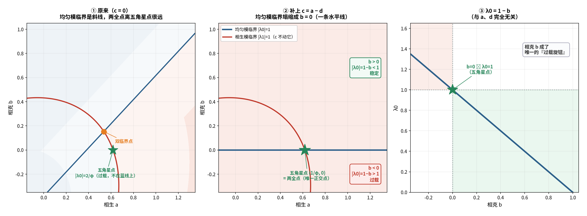

# 对接①续六：把 `c = a − d` 套上相图——均匀模临界线塌缩成 `b = 0`

**任务**：在 `(a,b)` 相图上套一层"两全面" `c = a − d`，看它如何与两条临界线相交。

---

## 〇、答案

> **补上 `c = a − d` 后，均匀模的特征值只剩**
> ```
> λ_0 = 1 − b          （与 a、d 完全无关！）
> ```
> **于是"均匀模临界" `|λ_0| = 1` 塌缩成一条水平线：`b = 0`。**
>
> `c` **不动** `λ_1`，相生临界线原样不变——
> **两条线的唯一正交点，正好是五角星点 `(1/φ, 0)`。**



---

## 一、算（严格，5×5 实机验证）

模型 `M = (1−d)I + a·S − b·S² − (c/5)·J`，取 `c = a − d`：

| `a` | `b` | `c = a−d` | `λ_0`（实机） | `1−b` |
| :-- | :-- | :-- | :-- | :-- |
| 1/φ | 0.0 | 0.236068 | **1.000000000000** | 1.000000000000 |
| 1/φ | +0.2 | 0.236068 | **0.800000000000** | 0.800000000000 |
| 0.8 | −0.3 | 0.418034 | **1.300000000000** | 1.300000000000 |
| 0.4 | +0.5 | 0.018034 | **0.500000000000** | 0.500000000000 |

> **`λ_0 = 1 − b`，十位有效数字全对，且完全不含 `a`、`d`。**

**推导**：`λ_0 = 1 − d + a − b − c`，代入 `c = a − d` ⟹ `λ_0 = 1 − b`。

---

## 二、几何：before / after（严格）

### ① 原来（`c = 0`）

- 均匀模临界线：`1/φ + a − b = ±1` ⟹ 斜线 `b = a − 1/φ²`；
- 与相生临界线 `|λ_1| = 1` 交于**双临界点** `(0.535, 0.153)`；
- **五角星点在 `|λ_0| = 2/φ` 处——过载，根本不在临界线上。**

### ② 补上 `c = a − d` 后

- 均匀模临界线**塌缩**为 `b = 0`（一条水平线）；
- 相生临界线**原样不动**（`c` 不碰 `k≠0`）；
- **两者的唯一正交点 = 五角星点 `(1/φ, 0)`。**

> **★ 所以"两全面"的作用就是：把双临界点搬到五角星点上。**
> 原来"临界"与"36°"是两个不同的点，套上 `c = a−d` 后**合二为一**。

**唯一性**：`|1/φ + aω| = 1` ⟹ `a² + a/φ² − 1/φ = 0` ⟹ `a = (−1/φ² ± φ)/2`，
正根 `a = 1/φ`（唯一），负根 `a = −1`（无物理意义）。

---

## 三、`b` 成了唯一的"过载旋钮"（严格）

```
b > 0  ⟹  |λ_0| = 1−b < 1   稳定
b = 0  ⟹  |λ_0| = 1         临界（五角星点）
b < 0  ⟹  |λ_0| = 1−b > 1   过载
```

**五行读法（结构性）**：

> **相克 = 制约 = 稳定。**「生」过热，就用「克」来压——
> 这本来就是五行的常识；这里它以 `λ_0 = 1 − b` 的形式显形。

---

## 四、两个旋钮的分工（严格）

| 旋钮 | 能否压 `\|λ_0\|` | 是否动 `arg λ_1` |
| :-- | :-- | :-- |
| `b`（相克强度） | ✅ | **✅ 会动**（`b=0.2` 时 `36° → 32.06°`） |
| `c`（总量饱和） | ✅ | ❌ **纹丝不动** |

> **`c` 是"保住 36°"的旋钮；`b` 是"调相位"的旋钮。**
> 两者都压过载，但只有一个不伤几何。

**这也给了"两全"一句更准的话**：

```
要 36° 又要不过载  ⟹  必须用 c（而不是 b）来压
```

---

## 五、闭环到"最终方程"

```
x_i(t+1) = (1 − d)x_i + a(Sx)_i − b(S²x)_i − c·X̄
  a = 1/φ,  d = 1/φ²,  c = a − d = 1/φ³,  b = 0
```

- `b = 0`：**只有相生**（原稿的说法）——此时均匀模恰好临界；
- `c = a − d`：**饱和 = 净驱动**——把过载精确收掉；
- 结果：`λ_0 = 1`、`λ_1 = e^(i36°)`，**两个临界同时成立**。

---

## 六、标注

| 主张 | 判定 |
| :-- | :-- |
| `λ_0 = 1 − b`（在 `c = a−d` 下） | **严格（实机 + 推导）** |
| `\|λ_0\| = 1 ⟺ b = 0` | **严格** |
| `c` 不影响 `λ_1` | **严格** |
| `\|λ_1\|=1` 与 `b=0` 唯一正交点 `a = 1/φ` | **严格（二次方程）** |
| 两全面把双临界点搬到五角星点 | **严格** |
| `b>0` 稳定 / `b<0` 过载 | **严格** |
| "相克 = 制约 = 稳定" | **结构性** |
| "`c` 保几何、`b` 调相位" | **严格** |

---

## 七、下一步

1. **三维图**：以 `(a, b, c)` 为轴，画出"两全面"`c = a−d` 与两个临界面，看三条面如何交于五角星点。
2. **`b ≠ 0` 的代价**：若坚持用相克（`b>0`）压过载，36° 会漂到多少？能否用 `c` 补偿回来？

---

*报告版本：v1.0*
*时间：2026-09-17*
*方式：先算后说（实机验证 λ0=1−b、临界限塌缩、交点唯一性、两旋钮分工）+ 三层标注*
*上游：01e-total-saturation-two-win.md｜01c-rn-scales-in-phase-diagram.md*
