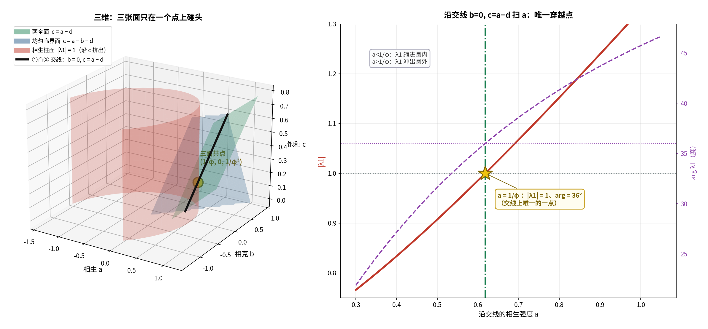

# 对接①续七：三维——三张面只在一个点上碰头

**任务**：在 `(a, b, c)` 三维里画出"两全面"与两个临界面，看它们如何交于五角星点。

---

## 〇、答案

> **三张面**
> ```
> ① 两全面     c = a − d                （平面）
> ② 均匀临界面 c = a − b − d            （平面）
> ③ 相生柱面   |λ1| = 1                 （沿 c 挤出的柱面）
> ```
> **只在一个点上碰头**：
> ```
> (a, b, c) = (1/φ, 0, 1/φ³)
> ```



---

## 一、三面方程（严格）

- **① 两全面**：`c = a − d`（来自一般定理 `c = a−d ⟺ λ_0 = 1`）；
- **② 均匀临界面**：`λ_0 = 1 − d + a − b − c`，令 `|λ_0| = 1` 得 `c = a − b − d`（取 `+1` 支）；
- **③ 相生柱面**：`|λ1| = 1` 与 `c` **无关**，所以在三维里是沿 `c` 方向**挤出的柱面**。

**共点校验**（在 `(1/φ, 0, 1/φ³)`）：

```
① c = 1/φ − 1/φ² = 1/φ³  ✓
② c = 1/φ − 0 − 1/φ² = 1/φ³  ✓
③ |λ1| = 1.0000000000 ∠ 36.000000°  ✓
```

---

## 二、两两交线（严格）

| 交线 | 方程 | 形状 |
| :-- | :-- | :-- |
| ①∩② | `a−d = a−b−d` ⟹ **`b = 0`**，`c = a − d` | **一条直线** |
| ①∩③ | `θ ↦ (a(θ), b(θ), a(θ) − d)` | 曲线 |
| ②∩③ | `θ ↦ (a(θ), b(θ), a(θ) − b(θ) − d)` | 曲线 |

**三者的公共点** = ①∩②（那条直线）与 ③ 的交点。

> **在直线 `b = 0, c = a−d` 上，`|λ1| = 1` 的二次方程只有一个正根 `a = 1/φ`。**

---

## 三、沿交线扫 `a`（严格）

| `a` | `c = a−d` | `\|λ1\|` | `arg λ1` | 状态 |
| :-- | :-- | :-- | :-- | :-- |
| 0.40000 | 0.018034 | 0.833518 | 27.155° | 圆内 |
| 0.50000 | 0.118034 | 0.907165 | 31.614° | 圆内 |
| **0.618034** | **0.236068** | **1.000000** | **36.000°** | **圆上（唯一）** |
| 0.70000 | 0.318034 | 1.067400 | 38.587° | 圆外 |
| 0.90000 | 0.518034 | 1.239248 | 43.686° | 圆外 |

**唯一穿越点**：`a = 1/φ`。

---

## 四、一个值得留意的细节

直线 `b = 0, c = a−d` 是**一维自由度**——在这条线上 `λ_0 = 1` **恒成立**（一般定理）。

> **但"两全"（`|λ_0| = |λ_1| = 1` 同时成立）** 只有**孤立一点**：
> 因为 `|λ_1| = 1` 在这条线上只被满足一次。

**换句话说**：

```
只要求"均匀模临界"       ⟹  一整条线（b=0, c=a−d）
要求"两个模都临界"       ⟹  一个点（a,b,c)=(1/φ, 0, 1/φ³)
再加"相位 = 36°"         ⟹  同一个点（自动满足）
```

---

## 五、意义

三面共点 = 三件事**同时**成立：

1. **饱和 = 净驱动**（`c = a − d`）；
2. **均匀模临界**（`λ_0 = 1`）；
3. **相生模临界且相位 36°**（`λ_1 = e^(i36°)`）。

> **这就是"两全"的几何定义**：三张面交于一点，别无他处。

---

## 六、标注

| 主张 | 判定 |
| :-- | :-- |
| 三面方程 ①、②、③ | **严格** |
| ①∩② = 直线 `b=0, c=a−d` | **严格** |
| 在 ①∩② 上 `λ_0 = 1` 恒成立 | **严格（一般定理）** |
| `\|λ1\|=1` 在 ①∩② 上唯一正根 `a = 1/φ` | **严格（二次方程）** |
| 三面共点 `(1/φ, 0, 1/φ³)` 唯一 | **严格** |
| "两全是孤立点，均匀临界是一整条线" | **严格** |
| "三面共点 = 两全的几何定义" | **结构性** |

---

## 七、下一步

1. **`b ≠ 0` 的代价**：若坚持用相克压过载，36° 会漂到多少？能否用 `c` 补偿回来？
2. **把三维图里的 ①∩③ 曲线画粗**：它是"只要饱和不要相克"时的相位漂移轨迹。

---

*报告版本：v1.0*
*时间：2026-09-17*
*方式：先算后说（三面方程、两两交线、共点唯一性、沿线扫描）+ 三层标注*
*上游：01f-saturation-face-on-phase-diagram.md｜01e-total-saturation-two-win.md*
