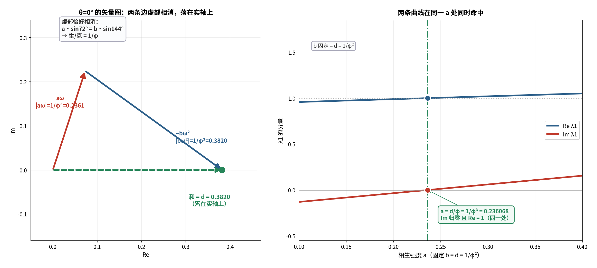

# 对接①续八：θ=0° 点 `(1/φ³, 1/φ²)` 的物理意义

**任务**：为什么"相位归零"要配"手性 = 衰减"的比值？

---

## 〇、答案

> **"相位归零"（图案不旋转）需要两个条件，缺一不可：**
>
> 1. **实性**：`a/b = sin144°/sin72° = 1/φ`
>    —— **生/克之比 = 五角星 36° 与 72° 的正弦之比**；
> 2. **临界**：`b = d` —— **相克 = 衰减**。
>
> **两条合起来 ⟹ `a = d/φ = 1/φ³`，即手性 `χ`。**
>
> **一句话：手性不是独立的第三个参数——它是"衰减被 φ 除"。**



---

## 一、条件 1：虚部必须相消（严格）

```
λ1 = 1 − d + a·ω − b·ω²
```

`a·ω − b·ω²` 要为**实**数 ⟺ `Im = 0` ⟺

```
a·sin72° = b·sin144°   ⟹   a/b = sin144°/sin72°
```

实算：

```
sin72°  = 0.95105652
sin144° = 0.58778525
比值    = 0.6180339887  =  1/φ   ✓
```

**几何来源**：`sin144° = sin36°`，而

```
sin36°/sin72° = 1/(2cos36°) = 1/φ
```

> **所以"生/克 = 1/φ"不是任意规定，而是五角星里 36° 与 72° 的正弦之比。**

---

## 二、条件 2：`b = d` 让它落到 1（严格）

取 `b = d`、`a = b/φ = d/φ`：

```
a·ω − b·ω² = (d/φ)·ω − d·ω² = (d/φ)·(ω − φω²) = (d/φ)·φ = d
```

**关键是黄金恒等式 `ω − φ·ω² = φ`（实数！）**（见 §三）。于是

```
λ1 = 1 − d + d = 1        ✅
```

**实算**（`d = 1/φ²`）：`aω − bω² = 0.381966011250 + 0.000000000000i = d` ✅，
`λ1 = 1.000000000000`（实、正）✅

---

## 三、黄金恒等式 `ω − φ·ω² = φ`（严格）

```
e^(i72°) − φ·e^(i144°) = φ
```

| 分量 | 值 | 判定 |
| :-- | :-- | :-- |
| 实部：`cos72° − φ·cos144°` | `1.61803399` | `= φ` ✅ |
| 虚部：`sin72° − φ·sin144°` | `−2.2×10⁻¹⁶` | `≈ 0` ✅ |

**这条恒等式就是"虚部相消"的代数形式**——也正是 `sin144°/sin72° = 1/φ` 的另一面。

---

## 四、一般式（严格）

对**任意** `d`，θ=0 点都是 `(a, b) = (d/φ, d)`：

| `d` | `a = d/φ` | `b = d` | `λ1`（实机） |
| :-- | :-- | :-- | :-- |
| 0.2 | 0.12361 | 0.20000 | **1.000000000000** |
| `1/φ²` | `0.23607` | `0.38197` | **1.000000000000** |
| 0.5 | 0.30902 | 0.50000 | **1.000000000000** |

> **`χ = d/φ` —— "相生 = 衰减 ÷ φ"。**

---

## 五、为什么"手性"要配"衰减"（意义）

**相位归零 = 图案不旋转**（纯振幅模式，不是行波）。

| 条件 | 作用 | 结果 |
| :-- | :-- | :-- |
| 生/克 = 黄金比 `1/φ` | 两项**虚部相消** | **不转** |
| 克 = 衰（`b = d`） | 实部**恰好抵消** `1−d` 的偏离 | **停在 1** |
| 两者合并 | — | **生 = 衰/φ = 手性** |

> **所以"手性"不是外加的第三个参数，而是"衰减"乘以 `1/φ`。**

这与《手性的物理读法》里"手性 = 生 − 衰 = `1/φ³`"**是同一件事的两种说法**：

```
1/φ³ = (1/φ²)/φ = d/φ        （本报告：衰减 ÷ φ）
1/φ³ = 1/φ − 1/φ² = a − d    （前作：生 − 衰）
```

---

## 六、五行的读法（结构性）

- **"生/克 = `1/φ`"** = 五角星的黄金比；
- **"克 = 衰"** = 制约强度恰等于自然衰减率；
- **两者同时成立 ⟹ 生克精确抵消，图案不转（相位 0）。**

**对照**：

| 点 | 生/克 | 相位 | 形态 |
| :-- | :-- | :-- | :-- |
| θ=0° | 精确 = `1/φ` | `0°` | **生克平衡 ⟹ 不转** |
| θ=36°（五角星点） | 失衡（`b=0`） | `36°` | 每步转 36° |

---

## 七、标注

| 主张 | 判定 |
| :-- | :-- |
| 实性 ⟺ `a/b = sin144°/sin72°` | **严格** |
| `sin144°/sin72° = 1/φ` | **严格（数值）** |
| `ω − φω² = φ`（实） | **严格** |
| `b = a·φ` 且 `b = d` ⟹ `λ1 = 1` | **严格** |
| 一般式 `(a,b) = (d/φ, d)` 对任意 `d` 成立 | **严格（实机）** |
| `χ = d/φ` | **严格** |
| "θ=0 = 生克平衡 ⟹ 不转" | **结构性** |
| "手性 = 衰减 ÷ φ，不是独立参数" | **严格（恒等）** |

---

## 八、下一步

1. **把"生/克 = 1/φ"推广**：θ 取其他值时，生/克 与相位是什么关系？（应该是一条"生克比 ↔ 相位"的曲线）
2. **回到五行**：θ=0 的"生克平衡"对应哪种中医状态（平人/阴阳自和）？

---

*报告版本：v1.0*
*时间：2026-09-17*
*方式：先算后说（虚部相消、黄金恒等式、一般式、实机验证）+ 三层标注*
*上游：01d-tradeoff-on-the-sheng-line.md｜01a-physical-reading-of-chi.md*
