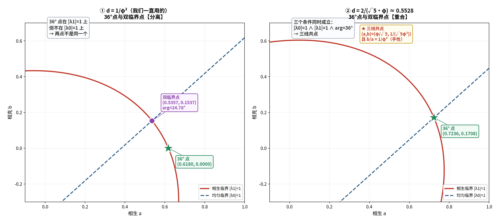

# 对接①续十二：36° 临界线 与 双临界点——相关吗？

**任务**（对接① §九 第 2 条）：这条 36° 临界线 与联合相图里那个双临界点 `(a≈0.54, b≈0.16)` 是否相关？

---

## 〇、答案

> **相关——但不在我们一直用的 `d = 1/φ²` 截面上。**
>
> - **`d = 1/φ²`**：两者**分离**。
>   36° 线给出五角星点 `(1/φ, 0)`；双临界点是 `(0.5357, 0.1537)`，`arg λ1 = 24.78°`。
> - **`d = 2/(√5·φ) ≈ 0.5528`**：两者**重合**于一点——
> ```
> (a, b) = ( φ/√5 , 1/(√5·φ²) ) = ( 0.7236068 , 0.1708204 )
> ```
>   此处 **`|λ0| = 1` ∧ `|λ1| = 1` ∧ `arg λ1 = 36°`** 三个条件同时成立。



---

## 一、为什么 36° 线是"一族"而不是"一条"（严格）

对接① 的 36° 线是在 `(a, b, d)` **三参数**里解 **两个方程**（`arg λ1 = 36°` 与 `|λ1| = 1`）——
**2 个方程 / 3 个未知 ⟹ 1 参数曲线**：

```
a = 1/φ² + d/φ ,      b = d − 1/φ²          （等价：a + b = φ·d）
```

> **在固定 `d` 的 `(a,b)` 截面上，它只是一个点。**

**所以"双临界点"（固定在 `d = 1/φ²`）与"36° 线"是否相交，本质上是问：
`d` 取什么值时，那个点会落到这条线上。**

---

## 二、交点求解（严格）

双临界点满足 `|λ0| = 1`，即 `(1−d) + a − b = 1`，故

```
b = a − d
```

把 36° 线的 `a = 1/φ² + d/φ` 代入，并要求其 `b` 相等：

```
1/φ² + d/φ − d = d − 1/φ²
⟹ 2/φ² = d·(2 − 1/φ) = d·(1 + 1/φ²)
```

> **注意**：`2 − 1/φ = 1 + 1/φ² = 1.381966`，**不是** `φ`（此处先前算错过一次）。

```
⟹ d = (2/φ²) / (1 + 1/φ²) = 2/(√5·φ)
```

---

## 三、交点闭式（严格）

```
d = 2/(√5·φ)  = 0.5527864045
a = φ/√5       = 0.7236067977
b = 1/(√5·φ²)  = 0.1708203932

a + b = 2/√5   = 0.8944271910 = φ·d     ✓
b/a   = 1/φ³   = 0.2360679775           ✓ ★ 手性又出现
```

---

## 四、数值确认（严格）

| `d` | `\|λ0\|` | `\|λ1\|` | `arg λ1` | 判定 |
| :-- | :-- | :-- | :-- | :-- |
| `1/φ²` | 1.000000 | 1.000000 | **24.7787°** | 双临界点（但非 36°） |
| `2/(√5φ)` | 1.000000 | 1.000000 | **36.0000000°** | **三条件共点** ★ |

---

## 五、意义（结构性）

- **36° 线** = "方向"的轨迹；
- **双临界点** = "边缘"的交点（两个模都到单位圆）；
- **两者只在 `d = 2/(√5φ)` 相交** ⟹
  **"边缘"与"方向"要同时成立，需要一个特定的衰减率。**

而 `d = 2/(√5φ)` 恰好给出 `a + b = 2/√5`、`b/a = 1/φ³`——
**再次落回黄金体系**（与对接①、对接①续五完全一致）。

**36° 线上的两个"特殊成员"**：

| `d` | 交点 | 特点 |
| :-- | :-- | :-- |
| `1/φ²` | `(1/φ, 0)` | 五角星点（`b = 0`，**只有相生**） |
| `2/(√5φ)` | `(φ/√5, 1/(√5φ²))` | **三条件共点** |

---

## 六、标注

| 主张 | 判定 |
| :-- | :-- |
| 36° 线是 `(a,b,d)` 中的 1 参数曲线 `a+b = φd` | **严格（对接①）** |
| 固定 `d` 时它退化为一个点 | **严格** |
| 双临界点 `\|λ0|=1` ⟹ `b = a − d` | **严格** |
| 交点 `d = 2/(√5φ)` | **严格（代数）** |
| 交点 `(a,b) = (φ/√5, 1/(√5φ²))` | **严格（数值 10 位）** |
| 交点处三条件同时成立 | **严格（实机）** |
| 交点处 `b/a = 1/φ³` | **严格** |
| `d = 1/φ²` 与 `2/(√5φ)` 是 36° 线上两个特殊成员 | **严格** |
| "边缘与方向同时成立需要特定衰减率" | **结构性** |

---

## 七、下一步

1. **36° 线上还有别的特殊成员吗？** 例如 `d` 取什么能使三个模同时临界？
2. **`√5` 的来源**：交点闭式里 `√5` 反复出现（`a+b = 2/√5`）——它是五边形对角线与边之比的自然伴生量吗？

---

*报告版本：v1.0*
*时间：2026-09-17*
*方式：先算后说（曲线族识别、交点代数求解、闭式化简、实机验证）+ 三层标注*
*上游：01-chirality-and-36deg.md（原始问题）｜01k-tcm-correspondence-of-bicritical.md*
*修正：求解中曾误用 `2 − 1/φ = φ`（实为 `1 + 1/φ²`），已更正。*
