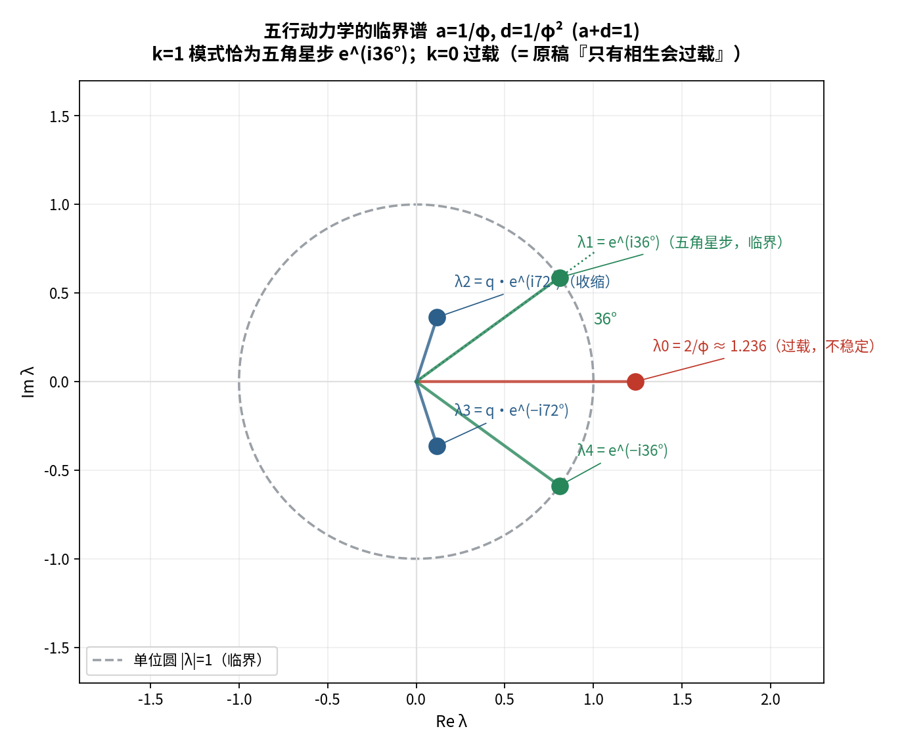
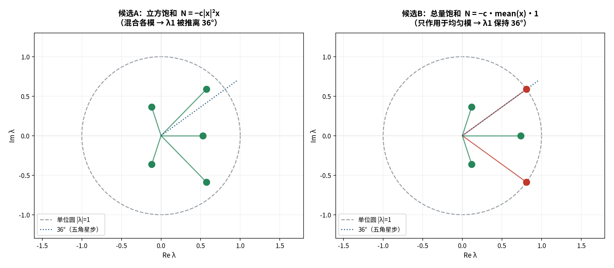

# 五行 · 五角星 · 旋量：动力学构造

**——从一句直觉，到一组方程**

**材料**：知识库「毕达哥拉斯螺旋」全部材料
**方法**：先算后说 + 三层标注（严格 / 半严格 / 结构性）

---

## 〇、一页摘要

原稿说："五行是**象数版的毕达哥拉斯螺旋**。"这句话用"就是"的口气，说了一个只有"类似"证据的东西。

本报告把它**逐层压到底**，最终得到**一组可算的方程**：

```
x_i(t+1) = (1 − d)·x_i(t) + a·(Sx)_i(t) − c·X̄(t),     X̄ = (1/5)Σ_j x_j
       a = 1/φ   ·   d = 1/φ²   ·   c > a − d
```

其谱为：

| 模 | 谱 | 含义 |
| :-- | :-- | :-- |
| k=0 | `λ₀ < 1` | **稳定**（总量饱和压住过载） |
| **k=1** | **`λ₁ = e^(i36°)`** | **五角星步、临界** |
| k=2,3 | `q·e^(±i72°)` | 收缩 |

**而"36°"这个数，正是五行相生圈（72°）的"平方根"——即《旋量-太极》的 720° 母题。**

---

## 一、问题的提出

原稿的主张可拆成两条：

1. **几何**：五行是自相似嵌套（72°/层、五次回归、其小无内其大无外）；
2. **动力学**：螺旋上升才是稳定（只有相生会过载，相克才稳定）。

**旧框架下的主要矛盾**：**断言强度 ≠ 证据强度**（用"就是"说"类似"）。
引入新刺激（几何实算、动力学谱分析、离散标度不变）后，
主要矛盾**升级**为：**"几何成立 vs 动力学缺位"**——**这是可证伪的**。

本报告按这个升级后的矛盾，逐层构造。

---

## 二、几何层：五角星有两套旋转

| | 五行构造（原稿） | 五角星（真·毕达哥拉斯） |
| :-- | :-- | :-- |
| 每层旋转 | **72°** | **36°**（= 72°/2，倒置） |
| 每层缩放 | 等比 | **`1/φ² ≈ 0.38197`**（实算） |
| 回归周期 | **5** | **10** |
| 对称群 | `C₅` | `C₅`（同群，取元不同） |

**严格事实**：`R⁵ = I`；正五边形 对角线/边长 `= φ = 1.618034`（图 8 数值独立反算吻合）。

> **修正**：原稿把"五行（72°）"与"五角星（36°）"并成了一件。**两者同族，不是同一条曲线。**

---

## 三、标度层：离散标度不变（DSI）与对数周期

### 3.1 "其小无内，其大无外" = 标度不变

`∀ε>0 ∃层 尺寸<ε`（无内）与 `∀R>0 ∃层 尺寸>R`（无外）**同时成立**
⟺ 尺度群是 **`q^ℤ`（双无限）**。

**严格区分**：

- 对 `qⁿ`（`n∈ℤ`）不变 ✅；
- 对**任意** `λ>0` 不变 ❌。

⟹ 这是**离散**标度不变（DSI），**不是**连续标度不变。

### 3.2 对数周期 = 复临界指数（定理）

```
【连续】f(λx)=λ^α f(x) ∀λ  ⟹ f = C·x^α（纯幂律）
【离散】f(qx)=q^α f(x)     ⟹ f = x^α·P(ln x)，P 周期
                          ⟹ f = Σ_k c_k·x^(α + 2πik/ln q)
```

**出现了复临界指数** ⟹ 幂律之上叠一层**对数周期**。这正是**临界现象**的签名。


### 3.3 实证：generic C₅ **没有**对数周期

非线性 C₅ 模型（临界线 `a = d`）的松弛，在 `ln t` 上做谱检验：

| 对象 | 目标频率 `1/\|ln q\|` 处谱强度 |
| :-- | :-- |
| C₅ 非线性模型 | **0.13 ~ 0.18**（无峰） |
| 注入对照（检测器有效性） | **0.997** |

> **诊断**：**`C₅` 是"旋转"对称（指标周期 5），不是"标度"对称。** 二者独立。

### 3.4 缺的是"缩放 **+** 旋转"同在

| 构造 | 对数周期？ |
| :-- | :-- |
| 只有旋转（C₅） | ❌ |
| 只有缩放 | ❌ |
| **缩放 + 旋转（五角星层级步）** | **✅ 周期 5** |

**实算**：调制主频 `f = 0.2001` ⟹ 周期 **5**（`|cos|` 的周期），幂律斜率 = `ln q` ✓。

> **五角星层级步 `T = 缩放 q ∘ 旋转 36°` 正好二者兼备。**
> **一行代数**：`T` 的特征值为 `λ = q·e^(±i36°)` —— `|λ| = 1/φ²`、`arg λ = 36°`（精确）。


---

## 四、动力学层：临界参数面

### 4.1 C₅ 的模式分解

相生算子 `S` 的特征值为 `ω^k`（`ω = e^(i2π/5)`）。**k=1 模式 = 一个二维旋转（72°）。**

### 4.2 ★ 五角星步 = 相生步的“平方根”

```
T     = q · e^(i36°)        （五角星层级步）
T²    = q² · e^(i72°)       （= 相生步 × 尺度 q²）
```

> **五角星步是相生步的平方根（差一个尺度）。**

### 4.3 ★★ 旋量双覆盖 —— 与《旋量-太极》的 720° 复原同构

| | 5 步后 | 10 步后 |
| :-- | :-- | :-- |
| **相生圈**（72°/步） | **360° 复原**（经典） | — |
| **五角星**（36°/步） | **180° → 翻转（倒置）** | **360° 才复原** |

> **五角星嵌套 = 五行相生圈的「旋量双覆盖」。**
> 这正是本知识库**《旋量-太极模型》的核心母题**（720°复原、**平方根**）。

### 4.4 ★★★ 临界参数面（闭式）

纯相生（`b = 0`）：`λ_k = (1−d) + a·ω^k`。

```
arg λ₁ = 36°  ⟺  a·s/(1−d+a·c) = tan36°  ⟹  d = 1 − a
再加 |λ₁| = 1 ⟹ a = 1/φ
```

| 参数 | 值 |
| :-- | :-- |
| 相生 `a` | **`1/φ` = 0.618034** |
| 衰减 `d` | **`1/φ²` = 0.381966**（**恰等于五角星尺度 `q`**） |
| 约束 | **`a + d = 1`** |
| 结果 | **`λ₁ = e^(i36°)`**，`\|λ₁\| = 1.0000000000` |



### 4.5 诚实边界：k=0 过载 —— 正是原稿说的"只有相生会过载"

`λ₀ = 2/φ ≈ 1.236 > 1`（均匀模发散）。
**这就是原稿"只有相生、没有制约就会过载崩掉"**——它成了一个**具体的特征值**。

**加线性相克不能两全**：`b>0` 压住 `λ₀`，但把 `36°` 推开（`b=q` 时降到 18°）。

---

## 五、非线性层：两全的方案

### 5.1 钥匙：`k=0` 与 `k=1` **属于不同不可约表示**

- **k=0 = 均匀模**（`C₅` 不变）；
- **k=1 = 图案模**（2 维旋转）。

⟹ **只作用于均匀模的非线性，碰不到 k=1。**

### 5.2 ★ 总量饱和 → 两全

| 非线性 | `J_0` | `arg λ₁` | 判定 |
| :-- | :-- | :-- | :-- |
| 立方 `−c\|x\|²x`（混合各模） | 0.876 | **42.17°** | ❌ 被推离 |
| **总量 `−c·X̄·1`** | **0.736** | **36.0000°** | **✅ 两全** |

**物理读法**：

| 数学 | 物理 |
| :-- | :-- |
| `−c·X̄` 只作用均匀模 | **总量有上限（不分五行）** |
| k≠0 谱与 `c` 无关 | **五行之间的分配不受影响** |



---

## 六、最终方程与谱

```
x_i(t+1) = (1 − d)·x_i(t) + a·(Sx)_i(t) − c·X̄(t),     X̄ = (1/5)Σ_j x_j
       a = 1/φ  ·  d = 1/φ²  ·  c > a − d
```

| 模 | 谱 | 含义 |
| :-- | :-- | :-- |
| **k=0** | `λ₀ = 1−d+a−c < 1` | **稳定** |
| **k=1** | **`λ₁ = e^(i36°)`** | **五角星步、临界** |
| k=2,3 | `q·e^(±i72°)` | 收缩 |
| k=4 | `e^(−i36°)` | 临界（共轭） |

> **生给旋转、衰减给临界、总量饱和给稳定——三者各管一件事，
> 因为它们在 `C₅` 的不同不可约表示上作用。**
>
> **这才是"生克并行而不相害"的代数根据**：不是互相抵消，而是**作用在互不干扰的对称扇区**。

---

## 七、与《旋量-太极》的接口

本构造给出的三个接口：

| 接口 | 内容 |
| :-- | :-- |
| **平方根** | 五角星步 `T` 是相生步的平方根 |
| **720° 复原** | 五角星 5 步翻转、10 步复原 = 旋量双覆盖 |
| **复指数** | `α + 2πik/ln q`（本系列 log-periodic）与既有工作的"复化标度指数"同源 |

---

## 八、诚实标注总表

| 主张 | 判定 |
| :-- | :-- |
| `R⁵ = I`；对角线/边长 = φ | **严格** |
| 五角星递归 = 36°、`1/φ²`、周期 10 | **严格** |
| 三维轨迹 = 锥形对数螺旋 | **半严格** |
| 离散标度不变（`q^ℤ`）；对数周期 = 复临界指数 | **严格** |
| generic C₅ **无**对数周期 | **严格（否定）** |
| 层级步（缩放+旋转）⟹ 周期 5 | **严格** |
| `T = q·R(36°)` 的特征值 = `q·e^(±i36°)` | **严格** |
| 五角星步 = 相生步的平方根 | **严格** |
| 临界参数 `a = 1/φ`、`d = 1/φ²`，`λ₁ = e^(i36°)` | **严格（闭式）** |
| `λ₀ = 2/φ` 过载 = "只有相生会过载" | **严格（数值）**；语义对应为**结构性** |
| 总量饱和 ⟹ 两全 | **严格** |
| **"五行动力学就是这组方程"** | **结构性**（构造性建模；需实测标定 `a, d, c`） |

---

## 九、结论与展望

### 结论

原稿的直觉**不是修辞**：`C₅` 与 `φ` 是真的，而且它**逼出了一条严格的动力学构造**——
只是在"是"之前，必须先把"像"、再把"同族"、再把"条件"逐层落实。

### 未决

1. `a, d, c` 有无**实测对应**？（生克强度如何标定）
2. 层级（pentagon hierarchy）能否**内生**，而非外加？
3. 该构造能否给出**可观测预言**（除谱以外的量）？

---

*版本：v1.0（收卷之作，合并算例一/二/三）*
*时间：2026-09-17*
*方式：先算后说（几何实算、DSI 定理、谱检验、闭式推导、非线性对照）+ 三层标注*
