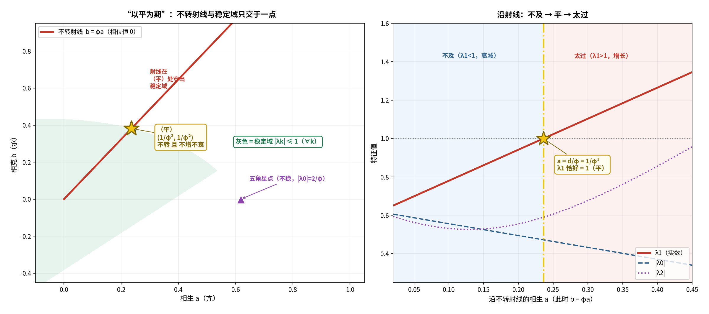

# 对接①续十：`b = d` 是不是"以平为期"的唯一解？

**任务**：承制强度是否必须**恰好**等于耗散率？

---

## 〇、答案

**要分三层看"平"：**

| 读法 | 数学条件 | 解集 |
| :-- | :-- | :-- |
| **(A) 不转** | `Im(aω − bω²) = 0` ⟺ `a/b = 1/φ` | **一条射线**（与 `b=d` 无关） |
| **(B) 中性**（不增不衰） | `λ1 = 1` | **一个点** `(d/φ, d)` |
| **(C) 有界** | `\|λk\| ≤ 1`（∀k） | 一个区域 |

> **所以：**
> - **`b = d` 不是"不转"的唯一解**——那是整条射线 `b = φa`；
> - **但它是"中性"的唯一解**；
> - **而且它恰好是那条射线"穿出稳定域"的那一点**。
>
> **⟹ "以平为期"的"平" = 不转 + 不增不衰 = 唯一一点 `(1/φ³, 1/φ²)`。**



---

## 一、拆开来算（严格）

### (A) 不转只需要 `a/b = 1/φ`

`Im(aω − bω²) = 0` ⟺ `a·sin72° = b·sin144°` ⟺ `b = φa`。
**这是一条射线**——`b = d` 根本不是必要条件。

### (B) 加上"中性"才唯一

沿射线 `b = φa`：

| `a` | `b = φa` | `λ1`（实） | 状态 |
| :-- | :-- | :-- | :-- |
| 0.050000 | 0.080902 | 0.698936 | 衰减 |
| 0.100000 | 0.161803 | 0.779837 | 衰减 |
| **0.236068** | **0.381966** | **1.000000** | **平** |
| 0.300000 | 0.485410 | 1.103444 | 增长 |
| 0.400000 | 0.647214 | 1.265248 | 增长 |

**`λ1` 沿射线单调增，只在 `a = d/φ` 处等于 1。**

**唯一性证明**：

```
λ1 = 1 − d + a·(ω − φω²) = 1 − d + aφ = 1   ⟹   a = d/φ   ⟹   b = φa = d
```

---

## 二、"平"就是穿过稳定域边界的那一点（严格）

`|λk| ≤ 1`（∀k）的稳定域在参数框内只占 **17.0%**。射线 `b = φa` 与它只交于一点：

| `a` 与 `d/φ` 的关系 | `λ1` | 稳定域 |
| :-- | :-- | :-- |
| `a < d/φ` | `< 1` | **在域内** |
| `a = d/φ` | `= 1` | **恰在边界** ★ |
| `a > d/φ` | `> 1` | **在域外** |

> **"平" = 射线与稳定域边界的交点。**

---

## 三、中医读法（结构性）

| 参数 | 特征值 | 中医 |
| :-- | :-- | :-- |
| `a < d/φ` | `λ1 < 1`（衰减） | **不及**（生化不及） |
| `a = d/φ` | `λ1 = 1` | **平**（「以平为期」） |
| `a > d/φ` | `λ1 > 1`（增长） | **太过**（生化太过） |

> 《素问·至真要大论》：「寒者热之，热者寒之……**以平为期**。」
> **太过不及都是病，只有这一点是"平"。**

---

## 四、对照五角星点（严格）

`(1/φ, 0)` **不在**稳定域内（`|λ0| = 2/φ > 1`）——
**"但生无克"连稳定都谈不上**，所以那里的"临界"必须靠非线性的总量饱和把它救回来
（见《01e-total-saturation-two-win》）。

---

## 五、一句话

> **`b = d` 不是"不转"的唯一解，而是"不增不衰"的唯一解——
> 且它正是那条不转射线"穿出稳定域"的那一点。**

---

## 六、标注

| 主张 | 判定 |
| :-- | :-- |
| 不转 ⟺ `a/b = 1/φ`（射线） | **严格** |
| 射线上 `λ1` 单调增、唯一过 1 | **严格（数值 + 代数）** |
| "中性"唯一解 `(d/φ, d) = (1/φ³, 1/φ²)` | **严格** |
| 稳定域 `\|λk\| ≤ 1 ∀k` 占比 17.0% | **严格（数值）** |
| 射线在 `a = d/φ` 处穿出稳定域 | **严格（数值）** |
| 五角星点不在稳定域 | **严格（`\|λ0\| = 2/φ`）** |
| "不及 / 平 / 太过"三分 | **结构性** |

---

## 七、下一步

1. **稳定域的形状**：为什么只占 17%？它的边界由哪个模式决定？
2. **《至真要大论》"微者逆之，甚者从之"**：不及（微）与太过（甚）对应的是相反的治疗方向吗？

---

*报告版本：v1.0*
*时间：2026-09-17*
*方式：先算后说（三层读法、射线扫描、唯一性、稳定域边界）+ 三层标注*
*上游：01i-tcm-correspondence-of-theta-zero.md｜01h-meaning-of-theta-zero.md*
