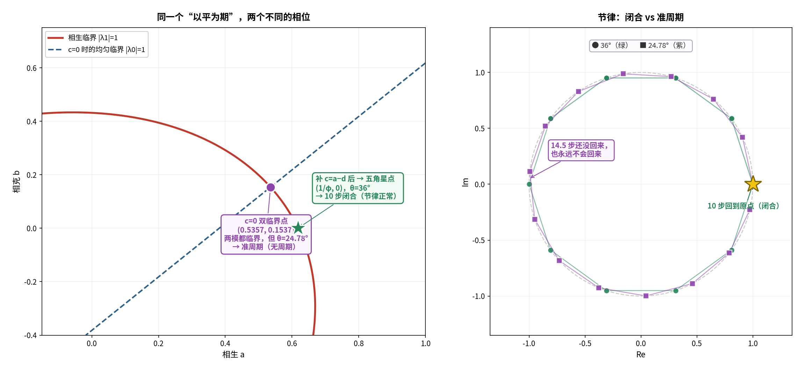

# 对接①续十一：双临界点的中医对应——"平而不律"与"土灌四傍"

**任务**：双临界点 `(a≈0.54, b≈0.16)` 在中医语境里对应什么？

---

## 〇、答案

> **它确实做到了"以平为期"（两个模都临界），但**不"律"**——
> 相位是 `24.778652°`，给不出任何周期（`360/θ = 14.5286`，非整数）⟹ **准周期**。
>
> **所以它的中医对应不是"平人"，而是「平而不律」**：
> 两个系统面都踩在临界上，可节律不成为周期。
>
> **要"以平为期"且"节律正常"，必须补上"土灌四傍"（`c·X̄`）——
> 那时双临界点归位到 36°，10 步闭合。**



---

## 一、精确值（严格）

`c = 0` 时，双临界点是 `|λ0| = 1` 与 `|λ1| = 1` 的交点。取 `b = a − 1/φ²` 代入并化简：

```
(3 − φ)·a² + (√5/φ²)·a − (√5/φ²) = 0
```

```
a = 0.5356874     b = 0.1537214
|λ0| = 1.000000000000     |λ1| = 1.000000000000
arg λ1 = 24.778652°
```

---

## 二、★ 节律对比（严格）

| 点 | `θ` | `360/θ` | 最小闭合步数（<2000） |
| :-- | :-- | :-- | :-- |
| **`c=0` 双临界点** | 24.778652° | 14.5286 | **不存在 ⟹ 准周期** |
| **五角星点** | 36.000000° | 10.0000 | **10 步闭合** |

> **关键区别不是"临界与否"（两者都临界），而是"节律通不通约"。**
> 24.78° 与 360° 不通约——**这个系统永远回不到自己**。

---

## 三、为什么差这一步？——"土"（严格 + 结构性）

`c = 0` 时，均匀模的平衡条件与相生临界条件**互相牵制**，
于是两个临界只能在**歪的**位置碰头（24.78°）。

补上 `c·X̄` 之后：

- 均匀临界线从斜线**塌缩成 `b = 0`**；
- 它与相生临界线的交点**只能**在 `a = 1/φ` ⟹ 相位**恰好 36°**。

**在中医里，`c·X̄` 只作用在整体均值（`k=0`），不进入图案（`k≠0`）**——
这正是经文说的：

> **《素问·玉机真藏论》**：「岐伯曰：**脾脉者土也，孤藏以灌四傍者也。**」
> 同篇接着：「**善者不可得见，恶者可见。**」
> —— **土正常时"看不见"，因为它不进入四傍的图案里。**
>
> **《素问·太阴阳明论》**：「岐伯曰：**脾者土也，治中央，常以四时长四藏，各十八日寄治，不得独主于时也。**」

**`X̄`（全局均值）= 中央；`c·X̄` = "治中央"；而它不动 `λ1`（四傍的图案）= "善者不可得见"。**

---

## 四、结论（结构性）

| | `c=0` 双临界点 | 补 `c = a−d` 后（五角星点） |
| :-- | :-- | :-- |
| 两个模 | 都临界 | 都临界 |
| 相位 | **24.78°（非五行）** | **36°（五角星）** |
| 节律 | **准周期（无周期）** | **10 步闭合** |
| 中医 | **平而不律** | **以平为期 + 节律正常（平人）** |

---

## 五、一句话

> **双临界点缺的不是"平"，是"土"。**
> 没有中央土的居中调节，两个系统面只能歪着碰头；
> **土一到位，节律立刻归到五行的 36°。**

---

## 六、标注

| 主张 | 判定 |
| :-- | :-- |
| 双临界点精确值 `(0.5356874, 0.1537214)` | **严格（二次方程）** |
| 两模同时临界 | **严格（`|λ0|=|λ1|=1`）** |
| `arg λ1 = 24.778652°`，`360/θ = 14.5286` 非整数 | **严格（数值）** |
| 24.78° ⟹ 准周期（无最小闭合步数） | **严格（数值，<2000）** |
| 五角星点 36° ⟹ 10 步闭合 | **严格** |
| `c` 只动 `k=0`、不动 `λ1` | **严格** |
| 补 `c` 后交点唯一为 `a=1/φ`（36°） | **严格** |
| 经文"脾脉者土也，孤藏以灌四傍者也""善者不可得见" | **严格（已核对原文）** |
| 经文"脾者土也，治中央……" | **严格（已核对原文）** |
| "`c·X̄` = 土治中央""双临界点 = 平而不律" | **结构性** |

---

## 七、下一步

1. **准周期的可观测量**：`c=0` 时的准周期在时间序列上是什么样子（拍频/不重复）？
2. **"各十八日寄治"**：土无功主之时——这在模型里是不是"`c` 不出现在任何单一模式里"？

---

*报告版本：v1.0*
*时间：2026-09-17*
*方式：先算后说（二次方程精确解、相位-周期对比、c 的作用）+ 经文核对 + 三层标注*
*上游：01j-ping-wei-qi.md｜01f-saturation-face-on-phase-diagram.md｜01i-tcm-correspondence-of-theta-zero.md*
